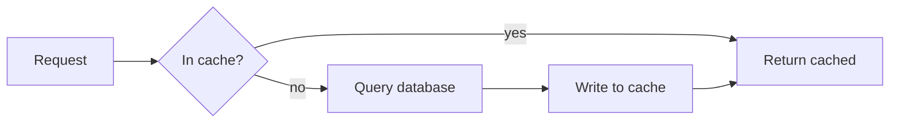

This post exists to prove the pipeline works. Every feature below is rendered by
the real renderer, so if something looks wrong here it is wrong everywhere. Once
you have looked at it in a browser, delete this file.

## Text and inline formatting

Ordinary paragraphs support **bold**, _italic_, `inline code`, ~~strikethrough~~,
and links to [the articles index](/articles). There is also ==highlighted text==,
H~~2~~O as subscript, and x^2^ as superscript. Press <kbd>Cmd</kbd> + <kbd>K</kbd>
to see raw HTML pass through untouched.

Emoji shortcodes resolve to real Unicode at render time :rocket: :white_check_mark:
so no images are fetched.

Here is a footnote reference[^1] that lands in a generated section at the bottom.

[^1]: Footnotes are collected automatically and linked both ways.

## Lists and definitions

- **A bulleted item** with a bold lead-in phrase, matching the house style.
- Another item, to show spacing between siblings.

1. Ordered lists work too.
2. Numbering is left to the browser.

Cache-aside
: The application checks the cache first and populates it on a miss.

Write-through
: Every write goes to the cache and the store together, so they never diverge.

## Callouts

> **Note:** This is the plain house-style callout, written as a blockquote with a
> bold lead-in.

> [!WARNING]
> This is a GitHub-style alert. The five kinds are NOTE, TIP, IMPORTANT, WARNING
> and CAUTION, and each gets its own accent colour.

## Code

A fence with a language gets syntax highlighting in both themes at once, and a
copy button:

```php
<?php

final class OrderRepository
{
    public function recentForVendor(int $vendorId, int $limit = 20): array
    {
        return Order::query()
            ->where('vendor_id', $vendorId)
            ->latest('created_at')
            ->limit($limit)
            ->get()
            ->all();
    }
}
```

A fence can also name the file it belongs to, which shows in the header bar:

```ts src/lib/posts.ts
export function getLatestArticles(count: number): ArticleSummary[] {
    return getAllArticles().slice(0, count);
}
```

## Diagrams

Mermaid blocks are rendered in the browser and follow the site theme:



A `flow` block is the interactive kind: it renders as a static diagram first, and
the reader can switch to a canvas that walks the path one hop at a time. Declare
scenarios to let one picture show more than one route.

```flow
title: How a request reaches the origin
packets: on

scenario "Cache hit"
> The edge already holds the response, so the origin is never touched.
Browser [the reader's tab] --> Edge (HTTPS) {secure}
Edge [CDN PoP] --> Browser (cached response) {allowed}
> Served from the PoP in a few milliseconds.

scenario "Cache miss"
> Nothing cached, so the request travels the whole way and back.
Browser --> Edge (HTTPS) {secure}
Edge --> Origin (forwarded) {neutral}
> The PoP has no copy, so it asks the origin.
Origin [the app server] --> Database (query) {neutral}
Database --> Origin (rows) {neutral}
Origin --> Edge (response + cache headers) {allowed}
> Stored at the PoP, so the next reader takes the short path above.
Edge --> Browser (response) {allowed}
```

## Images

Any image in the body opens full-screen, with pan and zoom. Where a post has more
than one, the arrow keys step between them without closing the viewer.


## Tables

Wide tables scroll inside their own frame rather than pushing the page sideways.

| Strategy      | Read cost | Write cost | Staleness window |
| ------------- | --------- | ---------- | ---------------- |
| Cache-aside   | Low       | Low        | Until TTL        |
| Write-through | Low       | High       | None             |
| Write-behind  | Low       | Low        | Until flush      |

## Headings and anchors

### A third-level heading

Every `##` and `###` gets a stable anchor id and an entry in the table of
contents on the right. Fourth-level headings and below deliberately get neither,
which keeps the contents list readable.
