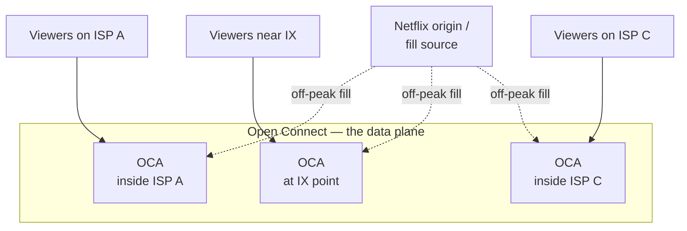
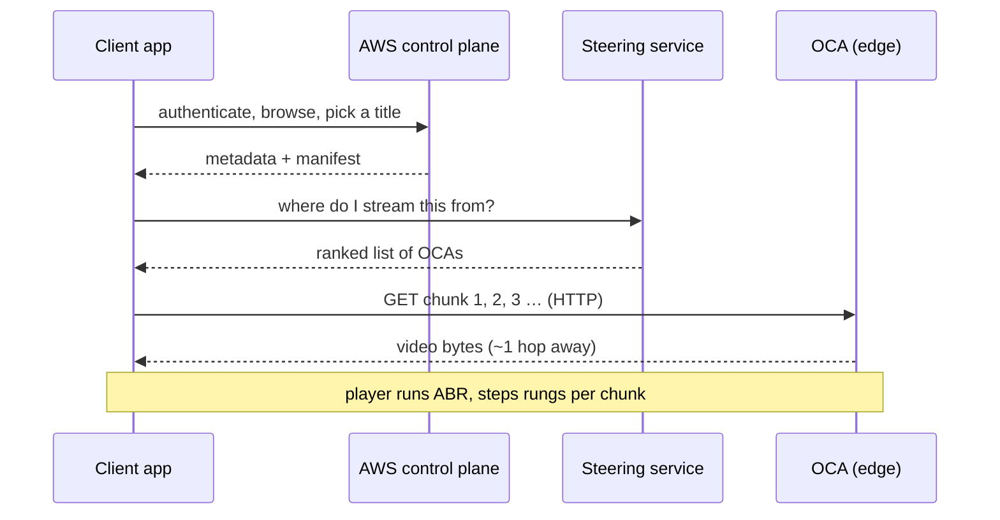

The prompt shows up in system-design interviews in almost exactly this form:

> Netflix has 270 million subscribers. 45% watch at the same time on Friday night —
> that's ~120 million streams simultaneously, each needing 4–15 Mbps. One movie, 190
> countries, zero buffering. How is that possible?

The trap is that it _sounds_ like a streaming problem, so people start drawing video
servers. It is really a **traffic-placement** problem. Once you do the arithmetic, the
answer writes itself: you cannot serve this from a data centre, so the only move left is
to have the bytes already sitting next to the viewer before they press play. Everything
Netflix built — Open Connect, predictive fill, adaptive bitrate, the AWS split — falls
out of that one constraint.

## Step 1: do the napkin math

Never accept the interviewer's numbers as scenery. They are the whole question. Multiply
them out.

> **Napkin math:** 120M concurrent streams × the bitrate per stream = total egress the
> system must sustain _at once_.
>
> - Floor (4 Mbps): 120,000,000 × 4 = **480 Tbps**
> - Ceiling (15 Mbps): 120,000,000 × 15 = **1,800 Tbps ≈ 1.8 Pbps**
> - Realistic mix (~8 Mbps): ≈ **960 Tbps ≈ ~1 petabit per second**

So the system has to push on the order of **a petabit per second**, continuously, during
peak. Hold that number — it is the fact that kills every naive design.

For scale: one of the largest internet exchange points on the planet, DE-CIX Frankfurt,
peaks in the high tens of Tbps.[^ixp] A petabit per second is roughly **50–100× an entire
major exchange**. There is no building, no fibre bundle, no cloud region with that egress.

The other number that matters is **storage read pattern**, not size. A single popular
title, encoded into every rendition Netflix ships (many codecs × resolutions × bitrates),
is a few hundred GB. Trivial to store once. The problem was never storing the movie — it
is _reading_ it 120 million times from places close enough that no packet crosses an ocean
under load.

## Step 2: see why the obvious designs die

Walk the interviewer through the failures on purpose. It shows you understand the
constraint, and it motivates the real answer.

| Design                           | What breaks                                                                           | Where it dies   |
| -------------------------------- | ------------------------------------------------------------------------------------- | --------------- |
| One big data centre              | ~1 Pbps egress; no facility has it                                                    | Bandwidth       |
| A few regional data centres      | Transit + peering costs; cross-ocean latency                                          | Bandwidth + $$  |
| Cloud object storage (S3) direct | Same egress wall, now metered per GB                                                  | Bandwidth + $$$ |
| Generic third-party CDN          | Works, but at Netflix's share of internet traffic the economics and control are wrong | Cost + control  |

Every row fails at the same place: **the bytes are too far from the viewer, and there are
too many viewers**. Distance is the enemy — each hop adds latency and each transit link is
a place congestion can start. The winning idea is to delete the distance.

## Step 3: move the bytes to the edge — Open Connect

Netflix's answer is its own CDN, **Open Connect**. Instead of streaming from a central
origin, Netflix ships purpose-built cache servers — **Open Connect Appliances (OCAs)** —
and places them _inside the network_, either directly in ISP data centres or at internet
exchange points.[^oc] Each is a dense box of storage and NICs whose only job is to serve
video chunks over HTTP at line rate.

The consequence: a viewer's stream terminates at a box that is often **one network hop
away**, inside their own ISP. The bytes never touch the public backbone, never cross an
ocean at play time, and never hit a Netflix data centre. The ~1 Pbps is not served from
one place — it is the _sum_ of thousands of OCAs each serving a manageable slice to the
users nearest them.



That dashed line is the trick that makes it affordable, and it deserves its own step.

## Step 4: fill the caches before anyone watches — predictive fill

Here is the part people miss. If an OCA fetched the movie from origin the moment a viewer
asked, you would have moved the bandwidth wall by one hop, not removed it — the origin
still has to serve everything once.

Netflix instead does **proactive, predictive fill**. During off-peak hours (the small
morning window in each region), OCAs pull the content they are _predicted_ to need, guided
by what is popular in that locale and by the recommendation and viewing data.[^oc] By the
time Friday night arrives, the movie is already sitting on the OCA inside your ISP. Peak
traffic reads from local disk; it never becomes origin traffic at all.

So the same title being watched by millions is not fetched millions of times across the
backbone. It is fetched **once per OCA, hours early, when the network is quiet**, then read
locally millions of times. That is how "one movie, 120 million streams" stops being a
contradiction.

```flow
title: A play request, hit vs miss
packets: on

scenario "Warm cache (the normal case)"
> The OCA inside your ISP was filled hours ago, off-peak. Peak traffic is local.
Client [your TV app] --> Steering (which OCA?) {secure}
Steering [runs on AWS] --> Client (ranked OCA list) {allowed}
Client --> OCA (fetch chunks over HTTP) {secure}
OCA [inside your ISP] --> Client (video, ~1 hop) {allowed}
> No backbone, no origin, no ocean crossing.

scenario "Cold miss (rare)"
> Content not yet on the nearest OCA — fall back up the hierarchy, once.
Client --> Steering (which OCA?) {secure}
Steering --> Client (next-best OCA) {neutral}
Client --> OCA (request) {neutral}
OCA --> Origin (fill this title) {neutral}
Origin --> OCA (content) {neutral}
OCA --> Client (video) {allowed}
> The miss fills the cache, so every later viewer takes the warm path above.
```

## Step 5: absorb the 4–15 Mbps spread — adaptive bitrate

Why is the per-stream number a _range_, not a fixed value? Because the client, not the
server, decides how much bandwidth it uses — moment to moment. That is **adaptive bitrate
streaming (ABR)**, delivered over HLS/DASH.

Netflix encodes each title into a **ladder** of renditions ahead of time. The video is cut
into small chunks (a few seconds each), and the player measures throughput and buffer
health and picks the highest rendition it can sustain for the _next_ chunk. Network dips →
step down a rung, no stall. Network recovers → step back up.

| Rung | Resolution | ~Bitrate    | Who lands here                  |
| ---- | ---------- | ----------- | ------------------------------- |
| Low  | 480p       | ~4 Mbps     | Mobile / congested / weak Wi-Fi |
| Mid  | 720p–1080p | ~5–8 Mbps   | Typical home broadband          |
| High | 1080p–4K   | ~10–15 Mbps | Fast link, big screen           |

Two refinements make the ladder cheaper and sharper than a fixed one:

- **Per-title encoding** — a simple cartoon and a grainy action film do not need the same
  bitrate for the same quality, so the ladder is computed _per title_ rather than applied
  uniformly.[^encode]
- **Per-shot / newer codecs** — bitrate is tuned per scene, and efficient codecs (AV1,
  HEVC) hit the same quality for fewer bits, which directly shrinks the ~1 Pbps.

ABR is what turns "zero buffering" from a promise into a fallback: the system does not
guarantee 4K to everyone — it guarantees the _best rung your link can hold right now_, and
degrades a notch instead of stalling. `4–15 Mbps` is the ladder, not a target.

## Step 6: split the plane — AWS vs Open Connect

The last piece is knowing what _doesn't_ run on the CDN. Netflix runs two systems with a
clean seam between them:[^aws]

- **Control plane — on AWS.** Sign-in, the app UI, search, the recommendation engine,
  billing, encoding pipelines, A/B tests, the API that answers "play this title." All the
  logic. None of the video bytes.
- **Data plane — on Open Connect.** Only the video chunks, served from OCAs at the edge.

When you press play, the client asks an AWS service, and a **steering** component returns a
_ranked list of OCAs_ for that client — chosen by network proximity, current OCA health and
load, and which boxes actually hold that title. The client then pulls chunks straight from
the best OCA over HTTP. AWS handled the decision; Open Connect handles the delivery.



This separation is why the two halves scale independently. Control-plane traffic is small
JSON. Data-plane traffic is the petabit. Keeping them apart means the expensive part
(bytes) lives where bytes are cheap (the ISP edge), and the smart part (decisions) lives
where compute is elastic (the cloud).

## The one-paragraph answer

If the interviewer wants it in thirty seconds: _You never serve 120 million streams from a
data centre — the math is ~1 Pbps, which no facility can egress. Netflix runs its own CDN,
Open Connect, placing cache appliances inside ISPs and exchanges. Content is predictively
filled to those caches off-peak, so peak reads are local — one hop from the viewer,
off-backbone. Adaptive bitrate lets each client pick a rung between 4 and 15 Mbps and
degrade instead of stall. AWS runs the control plane (auth, recommendations, steering);
Open Connect runs the data plane (the bytes). Distance is the enemy, so the design deletes
the distance._

## What the interviewer is really testing

The Netflix numbers are a prompt, but the skill is general. The reusable moves:

1. **Multiply the numbers first.** The petabit is hiding in the prompt; find it before you
   design anything.
2. **Name the binding constraint.** Here it is egress bandwidth and distance, not storage
   or compute.
3. **Push work to the edge and earlier in time.** A cache is just "closer in space"; a
   _predictive_ cache is also "earlier in time." Both remove load from the hot path.
4. **Split control from data.** Let the smart, small traffic and the dumb, huge traffic
   scale on different infrastructure.

Any CDN-shaped question — a viral video, a global game launch, a software update to a
billion devices — answers to the same four. Netflix is just the cleanest place to see them.

[^ixp]:
    Public peak-traffic figures from large internet exchange points (e.g. DE-CIX
    Frankfurt) sit in the high tens of Tbps; treat the exact number as an order-of-magnitude
    comparison, not a live reading.

[^oc]:
    Netflix Open Connect — appliances embedded in ISP and IX networks, filled proactively
    during off-peak windows based on predicted regional demand. See Netflix's own Open Connect
    overview for the canonical description.

[^encode]:
    Netflix's per-title (and later per-shot) encoding work is documented on the
    Netflix Technology Blog; the takeaway here is that the bitrate ladder is computed per title
    rather than applied uniformly.

[^aws]:
    The control-plane-on-AWS / data-plane-on-Open-Connect split is Netflix's stated
    architecture: everything except the video bytes runs on AWS; the bytes are served from the
    Open Connect edge.
