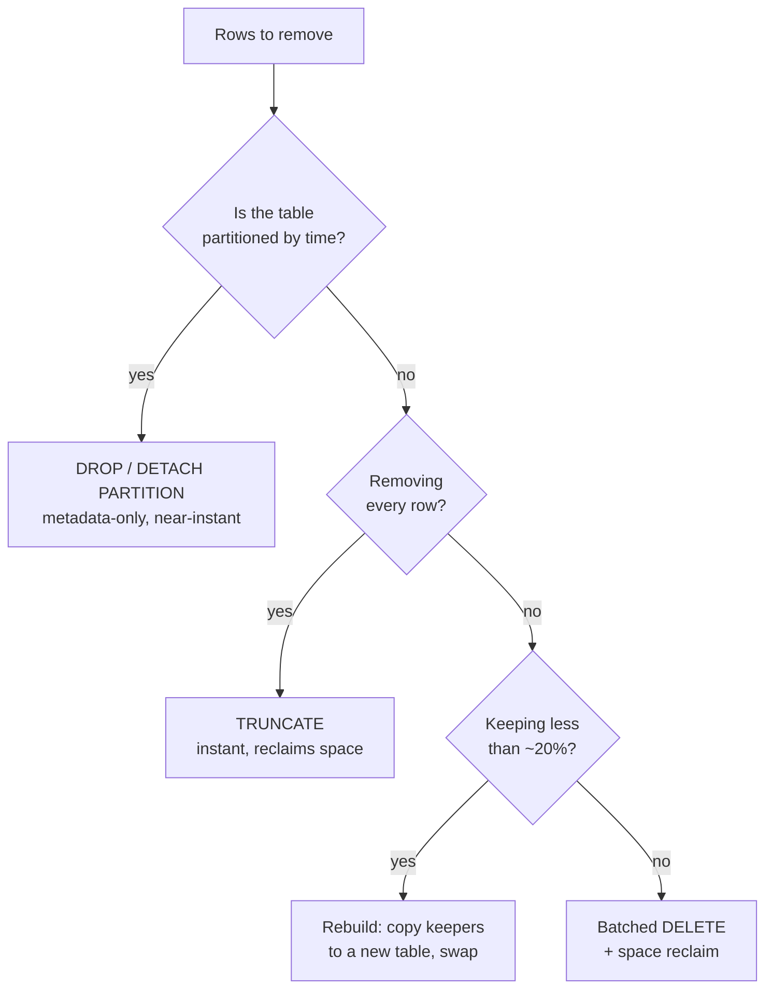

The question shows up in reviews, in interviews, and in every codebase older than
about three years:

> You discover a table has millions of rows nobody uses anymore, but you're not sure
> it's safe to delete. How would you approach cleaning it up?

The trap is that it sounds like a SQL question, so people answer with a `DELETE`
statement. It is really two separate problems wearing one coat:

1. **A correctness problem** — "nobody uses it" is a _hypothesis_. If you are wrong,
   you find out when the quarterly report runs, in a month, with no data to rebuild it
   from.
2. **An operational problem** — even when you are right, deleting millions of rows in
   one statement is its own outage: lock contention, replication lag, a binlog or WAL
   spike, and a table that gets _bigger_ on disk afterwards.

So the shape of the answer is: **prove it's dead, make it reversible, then delete it
slowly.** Nothing destructive happens until the first two are done.

## Step 0: the numbers that set the pace

Before designing anything, size the job — the same way you would size a traffic
problem.

> **Napkin math:** 40M rows × ~200 bytes/row ≈ **8 GB** of table data, plus indexes.
>
> - As one `DELETE`: one transaction holding ~8 GB of undo/dead tuples, one binlog or
>   WAL burst of roughly the same order, and a replica that must replay all of it
>   **serially**.
> - As 5,000-row batches: **8,000 statements**, each a few hundred milliseconds, each
>   individually killable, each giving replicas a gap to catch up in.

Same rows deleted. One version is a multi-hour lock nobody can cancel safely; the other
is a script you can stop at any batch. That contrast drives every decision below.

## Step 1: prove the table is actually dead

"Nobody uses it" usually means "nobody _I asked_ uses it." Replace opinion with
evidence from four independent places — code, the database's own counters, the
schema's dependencies, and time.

### Evidence 1 — the code

Grep everything, not just the service you're standing in. Old tables die because the
service that wrote them was decommissioned and something else still reads them.

```bash
# every repo, not just this one — ORM models, raw SQL, migrations, reports
rg -n --hidden -g '!node_modules' -e '\blegacy_events\b' ~/work/*/
```

Places a table name hides that a code search of one repo misses:

- BI tools and dashboards (Metabase, Looker, Redash) — queries live in _their_ database
- scheduled jobs: cron, Airflow DAGs, Lambda schedules, WordPress `wp_cron`
- ETL pipelines and replication filters (Debezium, Fivetran, materialised views)
- stored procedures, triggers, and views inside the database itself
- someone's saved query in a SQL client, which is not evidence you can gather — which
  is exactly why Step 2 exists

### Evidence 2 — the database's own read counters

Both engines already count reads per table. This is the strongest signal you can get
without changing anything.

**PostgreSQL** — `pg_stat_user_tables` has both counters and, since PostgreSQL 16,
timestamps for the last scan of each kind:

```sql
SELECT relname,
       seq_scan, last_seq_scan,      -- last_* need PostgreSQL 16+
       idx_scan, last_idx_scan,
       n_tup_ins, n_tup_upd, n_tup_del,
       pg_size_pretty(pg_total_relation_size(relid)) AS total_size
FROM   pg_stat_user_tables
WHERE  relname = 'legacy_events';

-- and the crucial context: how long have these counters been accumulating?
SELECT stats_reset FROM pg_stat_database WHERE datname = current_database();
```

**MySQL** — `performance_schema` counts table I/O:

```sql
SELECT object_schema, object_name,
       count_read, count_write, count_fetch, count_insert, count_update, count_delete
FROM   performance_schema.table_io_waits_summary_by_table
WHERE  object_schema = 'app' AND object_name = 'legacy_events';

-- counters are since the last server start, so check what that window covers
SHOW GLOBAL STATUS LIKE 'Uptime';
```

> [!WARNING]
> These counters reset on server restart (MySQL) or on a stats reset (PostgreSQL), and
> they are **per node**. A read-only reporting replica has its own numbers. Check the
> primary _and_ every replica, and record the window each number covers — "0 reads" over
> a six-day uptime says almost nothing.

You can also search the query cache for the table name, which catches queries no repo
contains:

```sql
-- PostgreSQL, needs the pg_stat_statements extension
SELECT calls, rows, query
FROM   pg_stat_statements
WHERE  query ILIKE '%legacy_events%'
ORDER  BY calls DESC;

-- MySQL, the normalised digest table
SELECT count_star, sum_rows_sent, digest_text
FROM   performance_schema.events_statements_summary_by_digest
WHERE  digest_text LIKE '%legacy_events%'
ORDER  BY count_star DESC;
```

### Evidence 3 — what the schema itself points at

A table can be unread by applications and still load-bearing for the schema. Ask the
catalog before you touch anything.

```sql
-- PostgreSQL: foreign keys pointing *at* this table
SELECT conrelid::regclass AS referencing_table, conname
FROM   pg_constraint
WHERE  confrelid = 'legacy_events'::regclass;

-- PostgreSQL: views and matviews that read it
SELECT schemaname, viewname FROM pg_views     WHERE definition ILIKE '%legacy_events%'
UNION ALL
SELECT schemaname, matviewname FROM pg_matviews WHERE definition ILIKE '%legacy_events%';
```

```sql
-- MySQL: foreign keys pointing at it
SELECT table_schema, table_name, constraint_name
FROM   information_schema.key_column_usage
WHERE  referenced_table_name = 'legacy_events';

-- MySQL: views that read it
SELECT table_schema, table_name
FROM   information_schema.views
WHERE  view_definition LIKE '%legacy_events%';
```

Two schema-level traps worth naming explicitly:

- **`ON DELETE CASCADE`.** Deleting 5,000 parent rows can silently delete millions of
  child rows in the same transaction, which destroys your careful batch sizing. Map the
  cascade tree _before_ choosing a batch size.
- **Row-level triggers.** They fire per deleted row. A "5,000-row batch" that runs an
  audit-log insert per row is a 10,000-row write.

### Evidence 4 — time

This is the one people skip, and it is the one that bites.

> [!IMPORTANT]
> Observe for at least **one full business cycle** — and the cycle that matters is the
> longest one, not the shortest. Month-end close, quarterly reporting, and the annual
> audit export are exactly the jobs that read a table nobody touches for 51 weeks a
> year.

So: instrument, then wait. Do not delete a table in the first week you noticed it.

## Step 2: climb the reversibility ladder

The single most useful reframe: **you are not deciding whether to delete. You are
choosing the least reversible action you are currently justified in taking.** Each rung
below is louder than the one above it and still fully undoable.

| Rung | Action                              | Reverses in | What it proves                       |
| ---- | ----------------------------------- | ----------- | ------------------------------------ |
| 1    | Write down the owner and the intent | —           | Someone is accountable               |
| 2    | Log or alert on reads               | instantly   | Who reads it, if anyone              |
| 3    | `REVOKE` access from the app roles  | one command | Nothing needs it, quietly            |
| 4    | `RENAME` the table                  | one command | Nothing needs it, **loudly**         |
| 5    | Archive the rows to cold storage    | a restore   | You can rebuild it if you were wrong |
| 6    | Delete rows / drop the table        | a restore   | —                                    |
| 7    | Reclaim the space                   | —           | —                                    |

Rungs 3 and 4 are the whole trick. Renaming a table takes milliseconds, is a metadata
change only, and converts your silent assumption into a loud, immediate, trivially
reversible failure:

```sql
-- MySQL
RENAME TABLE legacy_events TO zz_deprecated_legacy_events_20260816;
-- undo: RENAME TABLE zz_deprecated_legacy_events_20260816 TO legacy_events;

-- PostgreSQL
ALTER TABLE legacy_events RENAME TO zz_deprecated_legacy_events_20260816;
-- undo: ALTER TABLE zz_deprecated_legacy_events_20260816 RENAME TO legacy_events;
```

Anything still reading it now fails with `table doesn't exist` — a clear error, in your
logs, pointing at the caller, with a one-line fix. Compare that to the alternative,
where the same discovery arrives as a report that silently returns zero rows next
quarter.

The prefix matters more than it looks: `zz_deprecated_…_<date>` sorts to the bottom of
every table listing, reads as intentional to the next engineer, and carries the date
you started the clock.

```flow
title: Two ways to find out you were wrong
packets: on

scenario "Rename first (what to do)"
> Reversible probe. The failure is loud, immediate, and points at the caller.
Job [quarterly export] --> DB (SELECT FROM legacy_events) {neutral}
DB [table renamed] --> Job (ERROR: table doesn't exist) {blocked}
Job --> Alert (job failed, stack trace names the query) {allowed}
Alert [oncall] --> Restore (RENAME back, 1 command, seconds) {secure}
> You learn the table is alive while every row still exists.

scenario "Delete first (what happens instead)"
> Same discovery, months later, with nothing left to read.
Job --> DB (SELECT FROM legacy_events) {neutral}
DB --> Job (0 rows, no error) {blocked}
Job --> Report (renders an empty report) {blocked}
Report [shipped to finance] --> Restore (rebuild from backups, if any) {blocked}
> Silent wrong answers are the expensive failure mode, not errors.
```

Between rungs, **wait**. A rename that survives a full month-end is worth more evidence
than any query you can run.

### Archive before you delete

Rung 5 is cheap insurance. Cold storage costs approximately nothing compared to the
conversation where you explain that the data is gone.

```sql
-- PostgreSQL: write the rows out before removing them
COPY (SELECT * FROM legacy_events WHERE created_at < '2024-01-01')
TO PROGRAM 'gzip > /archive/legacy_events_pre2024.csv.gz' WITH (FORMAT csv, HEADER);
```

```bash
# MySQL: pt-archiver copies to a file and deletes in small, lag-aware chunks
pt-archiver \
  --source h=db-primary,D=app,t=legacy_events \
  --file '/archive/legacy_events-%Y-%m-%d.csv' \
  --where "created_at < '2024-01-01'" \
  --limit 1000 --commit-each \
  --check-slave-lag h=db-replica --max-lag 1s
```

> [!NOTE]
> An archive you have never restored is not an archive. Load one file into a scratch
> database and count the rows before you delete anything. The same applies to "we have
> backups" — verify the restore path, not the backup job's green tick.

And check the other direction too: some rows you are legally required to **keep**
(financial records under a statutory retention period), and some you are legally
required to **remove** (a GDPR erasure request). Both make this a policy decision, not
just an engineering one.

## Step 3: pick the right removal mechanism

Deleting rows one batch at a time is the general answer, not the only one. Choose by
what fraction of the table survives.



**Partition drop** is the best outcome by a wide margin — it is a catalog operation, so
40M rows disappear in the time it takes to update metadata:

```sql
-- PostgreSQL: detach first (brief lock), inspect, then drop at leisure
ALTER TABLE events DETACH PARTITION events_2023 CONCURRENTLY;
DROP TABLE events_2023;

-- MySQL
ALTER TABLE events DROP PARTITION p2023;
```

**`TRUNCATE`** is right only when every row goes. It is far faster than `DELETE` and
returns the space immediately, with one engine difference worth knowing: in PostgreSQL
`TRUNCATE` is transactional and can be rolled back; in MySQL it is DDL, so it commits
implicitly and cannot be undone. It also resets `AUTO_INCREMENT`, which matters if
anything stored those ids elsewhere.

**Rebuild-and-swap** wins when you are keeping a small minority of rows — copying 2M
survivors beats deleting 38M dead rows, and the new table arrives compact instead of
bloated:

```sql
CREATE TABLE events_new LIKE events;
INSERT INTO events_new SELECT * FROM events WHERE created_at >= '2024-01-01';
RENAME TABLE events TO events_old, events_new TO events;   -- atomic in MySQL
```

> [!CAUTION]
> That copy is only safe if nothing writes to `events` while it runs — otherwise the
> writes land in the old table and are lost at the swap. On a live table use
> `pt-online-schema-change` or `gh-ost` (MySQL), which maintain triggers or read the
> binlog to keep the copy current, rather than hand-rolling it.

## Step 4: batch the delete

When batching is the answer, the job is a loop, not a statement. Every batch is a
complete transaction that commits and releases its locks.

```sql
-- MySQL: repeat until affected rows < 5000.
-- Requires an index on created_at, or each batch scans the whole table.
DELETE FROM legacy_events
WHERE  created_at < '2024-01-01'
ORDER  BY id
LIMIT  5000;
```

```sql
-- PostgreSQL: the ctid sub-select keeps each statement's work bounded
DELETE FROM legacy_events
WHERE ctid IN (
    SELECT ctid FROM legacy_events
    WHERE  created_at < '2024-01-01'
    LIMIT  5000
);
```

The loop around it is where the safety lives:

```bash
#!/usr/bin/env bash
set -euo pipefail

BATCH=5000
while :; do
    deleted=$(mysql -N -B app -e "
        DELETE FROM legacy_events
        WHERE created_at < '2024-01-01' ORDER BY id LIMIT ${BATCH};
        SELECT ROW_COUNT();")

    echo "$(date -u +%FT%TZ) deleted=${deleted}"
    [ "$deleted" -lt "$BATCH" ] && break

    # let replicas catch up before the next batch
    lag=$(mysql -N -B -e "SHOW REPLICA STATUS\G" | awk '/Seconds_Behind_Source/{print $2}')
    while [ "${lag:-0}" -gt 1 ]; do
        sleep 5
        lag=$(mysql -N -B -e "SHOW REPLICA STATUS\G" | awk '/Seconds_Behind_Source/{print $2}')
    done

    sleep 0.2
done
```

The four properties that make this safe, in order of importance:

1. **Bounded transactions.** Each batch commits, so undo/dead tuples stay small, locks
   are short, and `Ctrl-C` between batches leaves a consistent database.
2. **Backpressure on replication.** Deletes replay serially on replicas. Without a lag
   check, a fast loop on the primary puts read replicas minutes behind and breaks
   read-your-writes for the whole application. Watch `Seconds_Behind_Source` (MySQL) or
   `replay_lag` in `pg_stat_replication` (PostgreSQL).
3. **A predicate the index covers.** Without an index on `created_at`, every batch
   full-scans the table and the job gets slower as it progresses.
4. **A visible log.** One line per batch, so you can see the rate, estimate the finish
   time, and stop when something looks wrong.

Tune `BATCH` down, not up. 5,000 is a reasonable start; if `p99` latency moves or lag
grows, halve it. The job finishing an hour later costs nothing.

## Step 5: reclaim the space

A surprise for anyone doing this the first time: **`DELETE` does not give the disk
back.**

- **PostgreSQL** marks tuples dead; `VACUUM` makes the space reusable by that table but
  does not return it to the OS. `VACUUM FULL` does, but takes an `ACCESS EXCLUSIVE`
  lock for the whole rewrite. On a live table use `pg_repack`, which rewrites it
  online.[^repack] Expect autovacuum to be busy for a while after a large delete — that
  is it doing its job.
- **MySQL/InnoDB** leaves the freed pages inside the tablespace. With
  `innodb_file_per_table` on, `OPTIMIZE TABLE` (an online rebuild) returns the space to
  the filesystem; with a shared tablespace it never comes back.

Also refresh statistics afterwards (`ANALYZE`), or the planner keeps choosing plans
sized for a table 20× bigger than it now is.

## Step 6: make it not happen again

The table got to 40M dead rows because nothing was ever going to remove them. Fix that,
or you repeat this in two years.

- **Write a retention policy in the schema**, not in a wiki: partition by month and
  drop old partitions on a schedule. That converts this whole article into one cron job
  running `DROP PARTITION`.
- **Give every table an owner** in whatever catalog you have — even a comment:
  `COMMENT ON TABLE events IS 'owner: payments-team; retention: 18 months';`
- **Keep the tombstone.** Leave the renamed table in place for a defined period (a
  quarter is typical), then drop it on a calendar reminder. The rename is the audit
  trail.

## The one-paragraph answer

If you need it in thirty seconds: _"Nobody uses it" is a hypothesis, so I'd gather
evidence before touching anything — grep every repo and BI tool, read
`pg_stat_user_tables` or `performance_schema.table_io_waits_summary_by_table` on the
primary and every replica, and check the catalog for foreign keys, views and triggers
pointing at it. Then I'd climb a reversibility ladder rather than jumping to `DELETE`:
revoke access, rename the table so any remaining reader fails loudly instead of
silently, and wait a full business cycle — the annual report is what catches you. Then
archive the rows to cold storage and verify a restore. Only then remove them, choosing
the mechanism by shape: drop a partition if it's partitioned, `TRUNCATE` if everything
goes, rebuild-and-swap if I'm keeping a small minority, otherwise a batched delete with
replication-lag backpressure. Finally reclaim space with `pg_repack` or `OPTIMIZE
TABLE`, and add a retention policy so it never grows back._

## What the question is really testing

The table is a prop. The transferable moves are:

1. **Treat "unused" as a claim requiring evidence**, and know where the evidence lives.
2. **Order actions by reversibility**, and spend the cheap reversible ones first.
3. **Prefer loud failures to silent ones** — a rename beats a delete because errors are
   better than wrong answers.
4. **Bound the blast radius of any bulk operation**, and add backpressure from the
   system that will actually feel it.
5. **Fix the process, not just the symptom**, so the cleanup is a one-time cost.

The same five apply to deleting a feature flag, decommissioning a service, or removing
a column. The dead table is just where they are easiest to see.

[^repack]:
    `pg_repack` rebuilds a table into a new file and swaps it in, taking only a brief
    exclusive lock at the end rather than holding one for the whole rewrite. It needs
    enough free disk for a second copy of the table, and the table needs a primary key
    or a unique, non-partial index on a `NOT NULL` column.
