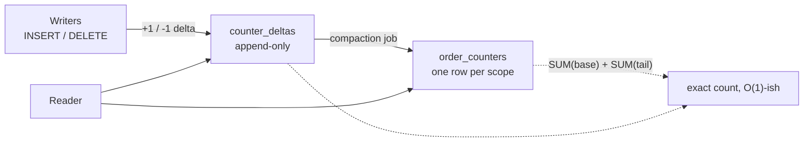

The question shows up in interviews and in production incident channels in the same form:

> `SELECT COUNT(*) FROM orders;` is slow on a 30M+ row table. So what would you do
> instead? How would you make `COUNT(*)` fast at scale?

The trap is that it looks like a query-tuning problem, so people start reaching for
indexes. It is really a **requirements** problem. An exact, live count of a 30M-row table
is inherently proportional to the table — no index makes that constant time. Every real
fix works by weakening one of three things you never actually needed all at once:
**exactness**, **freshness**, or **the count itself**.

Pick which one you can give up, and the answer writes itself.

## Step 1: know why it is slow

Both InnoDB and PostgreSQL are **MVCC** engines. A row is not a single fact; it is a set of
versions, and which versions exist for *you* depends on your transaction's snapshot. Two
concurrent transactions can legitimately see different counts of the same table at the same
instant.

That kills the obvious optimisation. There is no single number the engine could keep in the
table header, because there is no single correct answer. To count, the engine must walk
rows and ask "is this version visible to me?" once per row.

> **The old counter-example:** MyISAM *did* store an exact row count in the table header, so
> `SELECT COUNT(*)` was genuinely O(1). It could afford that precisely because it had no
> transactions and no MVCC. You are not getting that back — you traded it for concurrency.

So what does the engine actually do on a 30M-row table?

- **InnoDB** does not scan the clustered index if it can avoid it. `SELECT COUNT(*)` with no
  `WHERE` picks the *smallest* available secondary index and walks that instead, because
  fewer bytes per entry means fewer pages. MySQL 8.0.14+ can also read the clustered index
  with parallel threads (`innodb_parallel_read_threads`) for exactly this shape of query.
  Both help by a constant factor. Neither changes that it is O(rows).
- **PostgreSQL** can use an **index-only scan**, but only pays off where the visibility map
  marks pages all-visible — which means after a `VACUUM`. On a write-heavy table that has
  not been vacuumed recently, the "index-only" scan falls back to heap fetches per row and
  you get a sequential scan with extra steps.

Multiply it out. 30M rows in a narrow secondary index is on the order of a gigabyte of
pages to read; from cache that is hundreds of milliseconds, from disk it is seconds — and
it burns buffer pool that your actual workload wanted. Run it once a page load and you have
built a self-inflicted denial of service.

```sql
-- Always measure first. Note the difference between estimated and actual rows.
EXPLAIN ANALYZE SELECT COUNT(*) FROM orders;                      -- PostgreSQL
EXPLAIN ANALYZE SELECT COUNT(*) FROM orders;                      -- MySQL 8.0.18+
```

One myth to bury while you are here: `COUNT(*)`, `COUNT(1)` and `COUNT('x')` are the
**same plan** in both engines — the optimiser never materialises that constant. `COUNT(col)`
is different: it skips `NULL`s, which changes the answer and can force a wider index.

## Step 2: find out which count you were asked for

This is the step that saves the most time, and it is the one people skip. "Count the orders"
is four different questions wearing one hat:

| The real question              | Who asks it                | Exactness | Freshness  |
| ------------------------------ | -------------------------- | --------- | ---------- |
| How many pages of results?     | A paginated table UI       | None      | None       |
| Roughly how big is this table? | A dashboard tile, an admin | ±few %    | Minutes    |
| How many match this filter?    | A saved segment, a search  | Usually   | Seconds    |
| Exactly how many, right now?   | Billing, invoices, ledgers | Exact     | Immediate  |

Only the last row needs a real, consistent count — and it is almost always scoped to one
tenant or one period, not the whole table. Most `COUNT(*)` calls in a slow app are the first
row, which does not need a count at all.

## Step 3: delete the count (pagination)

The single most common source of `COUNT(*)` on a huge table is a paginator computing "page
17 of 1,483,222". Nobody visits page 900,000. You are paying a full scan on every request
to render a number that is decoration.

Two moves, and you can take both:

**Drop the total.** Ask for one row more than you need; if it comes back, there is a next
page. That is all a "Next / Load more" UI requires.

```sql
-- 20 rows for the page, plus a 21st row that only answers "is there more?"
SELECT * FROM orders ORDER BY created_at DESC, id DESC LIMIT 21;
```

**Drop the OFFSET too.** `LIMIT 20 OFFSET 400000` makes the engine fetch and discard 400,000
rows. **Keyset (seek) pagination** carries the last row's sort key forward instead, so every
page costs the same as the first:

```sql
-- Page N+1: everything strictly older than the last row of page N.
SELECT * FROM orders
WHERE (created_at, id) < ('2026-08-14 09:31:22', 88214413)
ORDER BY created_at DESC, id DESC
LIMIT 20;
-- Needs an index on (created_at DESC, id DESC) to be a pure range scan.
```

The tie-break column matters: `created_at` alone is not unique, so rows sharing a timestamp
would be skipped or repeated at the boundary. The composite key `(created_at, id)` is total.

In Laravel this is one method call. `paginate()` fires the count query;
`simplePaginate()` does not, and `cursorPaginate()` gives you keyset pagination outright:

```php
// Fires SELECT COUNT(*) — avoid on big tables
Order::latest()->paginate(20);

// No count query, prev/next only
Order::latest()->simplePaginate(20);

// Keyset pagination — no count, no OFFSET, stable under concurrent inserts
Order::orderBy('created_at', 'desc')->orderBy('id', 'desc')->cursorPaginate(20);
```

## Step 4: approximate, when "about 30M" is the honest answer

For a dashboard tile, the difference between 30,142,880 and "≈30.1M" is invisible to the
reader and free to the database. Both engines already keep an estimate for the planner.

```sql
-- PostgreSQL: maintained by VACUUM / ANALYZE, essentially free to read
SELECT reltuples::bigint AS approx_rows
FROM pg_class
WHERE oid = 'public.orders'::regclass;

-- MySQL / InnoDB: derived from random index dives, can drift far on some tables
SELECT TABLE_ROWS AS approx_rows
FROM information_schema.TABLES
WHERE TABLE_SCHEMA = DATABASE() AND TABLE_NAME = 'orders';
```

Read the caveats honestly. `reltuples` is `-1` on a table that has never been analysed, and
stale between autovacuum runs. InnoDB's `TABLE_ROWS` is a sampled estimate and can be off by
tens of percent on skewed tables — fine for "≈30M orders", not fine for anything a customer
reconciles against.

For a **filtered** count you can go one better and ask the planner directly. The estimate for
any query is already computed before execution; just read it instead of running the plan:

```sql
-- PostgreSQL: the planner's row estimate for an arbitrary query, without running it
CREATE FUNCTION count_estimate(query text) RETURNS bigint LANGUAGE plpgsql AS $$
DECLARE plan json;
BEGIN
    EXECUTE 'EXPLAIN (FORMAT JSON) ' || query INTO plan;
    RETURN (plan -> 0 -> 'Plan' ->> 'Plan Rows')::bigint;
END;
$$;

SELECT count_estimate($$SELECT 1 FROM orders WHERE status = 'pending'$$);
```

That is milliseconds regardless of table size, and its accuracy is exactly as good as your
statistics — which is to say, good for a magnitude, bad for a receipt.

## Step 5: cap the count when the UI caps the display

Search results do not need a true total either. GitHub shows `5,000+`. Google shows "about".
You can buy that behaviour outright by counting a bounded subquery:

```sql
-- Costs at most 1001 index entries, no matter how many rows actually match.
SELECT COUNT(*) AS bounded FROM (
    SELECT 1 FROM orders WHERE status = 'pending' LIMIT 1001
) AS capped;
-- bounded = 1001  ->  render "1000+"
-- bounded < 1001  ->  render the exact number
```

This is the highest-value trick in the list for filtered list views: below the cap the count
is **exact**, above it the work is **constant**, and the UI reads naturally at both ends.

## Step 6: index so the filtered counts are cheap

When you do need a filtered count and cannot cap it, make the engine count index entries
instead of rows. A count over `WHERE status = 'pending' AND created_at >= ?` should be a
range scan on a composite index in the same order as the predicate:

```sql
CREATE INDEX orders_status_created_at_idx ON orders (status, created_at);
```

The equality column comes first, the range column second — the reverse order forces the
engine to filter after the range scan instead of seeking straight to the matching block.
The scan then touches only matching entries, so a filter selecting 40,000 rows out of 30M
costs 40,000 entries, not 30M.

Two engine notes that decide whether this actually lands:

- **PostgreSQL** only gets a true index-only scan on pages the visibility map marks
  all-visible. If the count is still slow, check `EXPLAIN (ANALYZE, BUFFERS)` for
  `Heap Fetches:` — a high number means the table needs vacuuming more aggressively
  (`autovacuum_vacuum_scale_factor` down on that table).
- **InnoDB** secondary indexes carry the primary key, so a covering index on
  `(status, created_at)` already answers by PK without touching the clustered index.

This is a constant-factor win, not a complexity change. It fixes selective filters. It does
nothing for `COUNT(*)` over the whole table — nothing at this layer can.

## Step 7: maintain the count instead of computing it

When the count must be exact *and* instant *and* unfiltered, you stop computing it at read
time and start maintaining it at write time. The read becomes a single-row lookup; the cost
moves onto inserts and deletes, where it is one extra tiny write.

The naive version is a summary table kept by triggers:

```sql
-- PostgreSQL: exact counter, maintained transactionally
CREATE TABLE order_counters (scope text PRIMARY KEY, total bigint NOT NULL DEFAULT 0);

CREATE FUNCTION bump_order_counter() RETURNS trigger LANGUAGE plpgsql AS $$
BEGIN
    UPDATE order_counters
       SET total = total + (CASE TG_OP WHEN 'INSERT' THEN 1 ELSE -1 END)
     WHERE scope = 'all';
    RETURN NULL;
END;
$$;

CREATE TRIGGER orders_count_trg
AFTER INSERT OR DELETE ON orders
FOR EACH ROW EXECUTE FUNCTION bump_order_counter();
```

It is exact, transactional (a rolled-back insert rolls back its increment) and reads in
microseconds. **And it will fall over under load**, because every insert now updates the
same row, and row locks serialise. At a few hundred inserts per second on one hot counter
row, that single row becomes the write bottleneck for the whole table.

The fix is to stop having one row.

```sql
-- Sharded counter: writers spread across N rows, readers sum them.
CREATE TABLE order_counters (
    scope text   NOT NULL,
    shard smallint NOT NULL,
    total bigint NOT NULL DEFAULT 0,
    PRIMARY KEY (scope, shard)
);

-- Each writer touches one random shard, so lock contention drops ~N-fold.
UPDATE order_counters
   SET total = total + 1
 WHERE scope = 'all' AND shard = floor(random() * 16)::int;

-- The read is 16 rows, still a sub-millisecond lookup.
SELECT SUM(total) FROM order_counters WHERE scope = 'all';
```

The lock-free variant trades the update for an append: writers insert `(+1)` / `(-1)` deltas
into a ledger table (no contention at all, inserts never block each other), and a compaction
job periodically folds old deltas into one row. Reads sum the current row plus the small
uncompacted tail.



**Counters drift.** Bulk loads that bypass triggers, restores, a migration that disables
triggers, an application-level counter that missed a code path — all of them desynchronise
the number silently. Any counter you ship needs a reconciliation job: recompute the true
count off-peak (on a replica, where a full scan hurts nobody), correct the counter, and
**log the delta**. A drift that is always zero is a healthy system; a drift that grows tells
you which write path you missed.

## Step 8: roll up, so dashboards never touch the base table

Most "count" dashboards are not really asking for a single number — they want counts sliced
by day, by status, by tenant. Maintaining one counter per slice does not scale; a rollup
table does.

```sql
-- One row per (day, status). ~365 rows a year per status, not 30M.
CREATE TABLE order_rollup_daily (
    day    date NOT NULL,
    status text NOT NULL,
    total  bigint NOT NULL,
    PRIMARY KEY (day, status)
);

-- "Orders this month" = 30-ish sealed rows, plus a live count of today only.
SELECT (SELECT COALESCE(SUM(total), 0) FROM order_rollup_daily
         WHERE day >= date_trunc('month', CURRENT_DATE) AND day < CURRENT_DATE)
     + (SELECT COUNT(*) FROM orders WHERE created_at >= CURRENT_DATE) AS month_total;
```

That is the whole trick: **past days never change, so count them once**. Only today's
partial bucket is computed live, and it is bounded by one day of traffic instead of the
table's whole history. A nightly job seals yesterday's bucket; backfilling history is one
batch pass, once.

PostgreSQL will do a coarser version of this for you with a materialised view, if you can
tolerate the staleness and the refresh cost:

```sql
CREATE MATERIALIZED VIEW order_counts AS
SELECT status, COUNT(*) AS total FROM orders GROUP BY status;

CREATE UNIQUE INDEX ON order_counts (status);       -- required for CONCURRENTLY
REFRESH MATERIALIZED VIEW CONCURRENTLY order_counts;  -- readers keep the old copy
```

`CONCURRENTLY` avoids locking readers out during the refresh, at the price of a slower
refresh — and the refresh itself is still a full scan, so schedule it, do not trigger it per
request.

## Step 9: the two cheap outs, and when they are right

**Cache it.** A Redis key with a 60-second TTL turns 1,000 requests per minute into one query
per minute, and it is thirty minutes of work. Guard the stampede — when the key expires under
load, every request misses at once and they all run the scan together. Serve the stale value
while a single lock-holder refreshes in the background.

**Move it off OLTP.** If the counts are analytical — grouped, sliced, `COUNT(DISTINCT)` —
they do not belong on the transactional primary at all. A read replica keeps the scan away
from your write path; a column store (ClickHouse, DuckDB, BigQuery) counts a column of 30M
values in milliseconds because that is the shape it was built for.

While you are there: `COUNT(DISTINCT user_id)` is a strictly harder problem than `COUNT(*)`
— it needs a hash or a sort of every distinct value, not just a walk. If an approximation is
acceptable, HyperLogLog (`postgresql-hll`, ClickHouse's `uniqCombined`, Redis `PFCOUNT`)
gives you ~1% error in kilobytes of state.

## Step 10: the read path, put together

Nothing above is exclusive. A real system layers them, and the fast path never reaches the
base table:

```flow
title: Answering "how many orders?"
packets: on

scenario "The fast path (the normal case)"
> Cache hit, or a single-row counter read. No scan, no contention.
Client [dashboard tile] --> Cache (GET orders:count) {secure}
Cache [Redis, 60s TTL] --> Client (30,142,880) {allowed}
> Sub-millisecond. Most requests end here.

scenario "Cache miss"
> Falls through to the maintained counter, not to the table.
Client --> Cache (GET orders:count) {neutral}
Cache --> Counter (miss, read through) {neutral}
Counter [order_counters, 16 shards] --> Cache (SUM of shards) {allowed}
Cache --> Client (value + repopulated key) {allowed}
> Still no scan — the counter was maintained at write time.

scenario "Reconciliation (off-peak, on a replica)"
> The only place a full COUNT(*) is allowed to run.
Job [nightly cron] --> Replica (SELECT COUNT(*) FROM orders) {neutral}
Replica --> Job (true count) {neutral}
Job --> Counter (correct drift, log the delta) {allowed}
> A drift that stays at zero is proof the write path is complete.
```

## Picking one

| You need                        | Use                                  | Cost                        |
| ------------------------------- | ------------------------------------ | --------------------------- |
| Page navigation only            | Keyset pagination, `LIMIT n+1`        | None — the count disappears |
| A ballpark table size           | `reltuples` / `TABLE_ROWS`            | ~0 ms, ±few %               |
| A ballpark filtered count       | Planner estimate via `EXPLAIN`        | ~1 ms, statistics-accurate  |
| "1000+" in a result header      | Capped subquery with `LIMIT 1001`     | Bounded, exact below cap    |
| A selective filtered count      | Composite covering index              | O(matches), exact           |
| Exact total, instant, hot table | Sharded counter or delta ledger       | One small write per row     |
| Counts sliced by day/status     | Rollup table, seal past buckets       | One nightly job             |
| Analytical / `COUNT(DISTINCT)`  | Replica, column store, HLL            | Separate system             |

## The one-paragraph answer

If the interviewer wants it in thirty seconds: *Under MVCC there is no stored row count,
because visibility is per transaction — so an exact live `COUNT(*)` is proportional to the
table and no index makes it constant. So I would first ask what the count is for. If it is
pagination, I delete it: keyset pagination and `LIMIT n+1`. If it is a dashboard, I
approximate it from `reltuples` or the planner estimate. If it is a result header, I cap it
with a `LIMIT 1001` subquery so it is exact when small and bounded when large. If it must be
exact and instant, I maintain it at write time in a sharded counter or a delta ledger — one
row per shard to avoid lock contention — with a nightly reconciliation job on a replica to
correct drift. And anything grouped or `DISTINCT` goes to a replica or a column store,
because that is not an OLTP query.*

## What the question is really testing

The `orders` table is a prop. The reusable moves are:

1. **Interrogate the requirement before optimising the query.** Exact, live and cheap is a
   pick-two; find out which two.
2. **Move work from read time to write time.** Reads outnumber writes by orders of
   magnitude, so a small cost per write buys an enormous saving per read.
3. **Expect the hot row.** Any single maintained aggregate is a lock convoy waiting to
   happen; shard it or append to it.
4. **Assume derived state drifts, and reconcile.** A counter without a reconciliation job is
   a bug with a schedule.

Any "expensive aggregate at scale" question — sums, leaderboards, unread badges, feed counts
— answers to the same four. `COUNT(*)` is just the cleanest place to see them.
