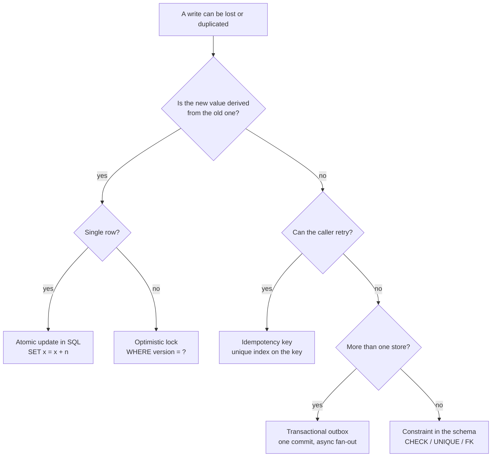

The senior version of the debugging interview usually arrives like this:

> Your system has processed 800 million requests without a problem. Then one request
> corrupts a user's data. You can't reproduce it. What do you investigate first?

The trap is to start guessing causes — "maybe a race condition?" — because that is what
the interviewer's question sounds like it wants. It isn't. The question is testing
whether you can run an **investigation with no repro**, and the honest first answer is
that you already have two enormous pieces of evidence before you touch any code:

1. **It happened once in 800 million.** That rules out entire categories of bug.
2. **You cannot reproduce it.** That is not a lack of information — it _is_ information.

So the shape of the answer is: **read what the failure rate and the corrupted value are
already telling you, reconstruct the timeline for that one record, then turn N=1 into a
population you can query.** Guessing comes last, and by then it usually isn't guessing.

## Step 0: what the two facts already rule out

A bug that reproduces is a bug whose inputs fully determine its behaviour. Yours does
not reproduce, so its behaviour depends on something that is **not** in the request.
That is a short list.

| What the bug depends on | Why it can't be reproduced          | Typical shape                                                    |
| ----------------------- | ----------------------------------- | ---------------------------------------------------------------- |
| **Interleaving**        | You can't replay thread scheduling  | Race condition, lost update, TOCTOU                              |
| **Concurrent state**    | The other request is gone           | Two writers, one row                                             |
| **Partial failure**     | The network only drops it sometimes | Retry of a non-idempotent write, half-completed saga             |
| **Time**                | The clock has moved on              | Clock skew, DST/leap boundary, TTL expiry mid-request            |
| **Environment**         | You're on a different node          | One bad replica, one stale pod, mixed deploy versions            |
| **Accumulated state**   | Your dev DB is fresh                | Connection-pool leakage, cache key collision, memoised singleton |

Notice what is _absent_: "bad input", "wrong SQL", "off-by-one". Those reproduce every
time you send the same request, and 800 million requests would have hit them a long
time before request 800,000,001.

> **Napkin math:** why "one in 800 million" is the _expected_ rate for a race, not a
> miracle. Say a request holds a stale value for a **5 ms** window between its read and
> its write, and a hot row is touched **10 times a day** by 100k users.
>
> - Chance a second writer lands in that 5 ms window ≈ `5ms / 86,400,000ms × 10` per
>   user-day ≈ **6 × 10⁻⁷**
> - Across ~1.4 million user-days inside those 800M requests: **≈ 1 expected collision**
>
> One occurrence is exactly what a millisecond-wide window predicts at this scale. The
> race was always there. Traffic simply grew until it got hit.

This is the reframe worth saying out loud in an interview: _the system did not process
800 million requests correctly and then break. It has been running a race for 800
million requests and lost one._

## Step 1: preserve the crime scene before you fix anything

The instinct is to repair the user's data. Do not, not yet — the corrupted row is your
only physical evidence, and an `UPDATE` destroys it.

The order that matters:

1. **Copy the record**, its related rows, and everything in the audit trail into a
   scratch table. `CREATE TABLE incident_1234_snapshot AS SELECT …`.
2. **Freeze the log retention window** covering the incident, before rotation deletes
   it. Binlogs, WAL archives, application logs, load-balancer logs, APM traces.
3. **Note the exact retention deadlines.** Binlogs commonly expire in days; your
   investigation now has a clock on it, and that clock decides your ordering.
4. _Then_ mitigate for the user — ideally by writing a corrected row, not by editing
   the corrupt one in place.

> [!WARNING]
> Every hour you spend deciding what to do is an hour of evidence expiring. Preserve
> first, decide second. The single most common way these investigations die is that the
> binlog rotated on day three.

## Step 2: read the shape of the corruption

Before opening any code, look hard at _what_ the wrong value is. The shape of the damage
is a fingerprint, and it narrows the cause dramatically.

| What the corrupted value looks like                      | What it usually means                                                                             |
| -------------------------------------------------------- | ------------------------------------------------------------------------------------------------- |
| A counter/balance is short by exactly one update         | **Lost update** — read-modify-write without locking                                               |
| The effect happened **twice** (double charge)            | **Retry of a non-idempotent operation**                                                           |
| Some fields updated, others still old                    | **Non-atomic multi-write** — two statements, no transaction                                       |
| Data belongs to a **different user or tenant**           | Request-scoped state held globally, cache key collision, pooled connection carrying session state |
| A field is `NULL`/zero/default that never should be      | Partial deserialisation, or a **mixed-version deploy** writing a schema the reader doesn't know   |
| Value written was correct in one store, wrong in another | **Dual write** — DB committed, cache/queue/search did not (or vice versa)                         |
| Timestamps out of order, or in the future                | **Clock skew** across nodes, or out-of-order queue delivery                                       |
| Foreign key points at a plausible but wrong row          | ID reuse, sequence reset after a restore, or an ID from another environment                       |

Two rows of that table are worth an explicit warning. "Data belongs to a different
user" is the most dangerous entry — it is usually not a database bug at all but a
**request-scoped value stored somewhere process-scoped** (a static, a module-level
variable, a singleton service holding the current user, a connection returned to the
pool mid-transaction). And "some fields updated, others old" is the one people
misdiagnose as a race when it is simply code that wrote twice without a transaction.

## Step 3: reconstruct the timeline for that one record

You cannot replay the request. You _can_ replay the row. Ranked by evidence quality
per unit of effort:

**1. Row history, if you kept any.** An audit table, an event log, a `versions` table,
soft-delete history, or `updated_at` plus `updated_by`. This is ground truth about what
the value was before.

**2. The database's own change log.** This is the highest-fidelity source most teams
forget they have — the replication stream contains before-and-after images of every
row.

```bash
# MySQL: decode row events for the incident window; -v renders the before/after images
mysqlbinlog --base64-output=DECODE-ROWS -vv \
  --start-datetime='2026-08-14 09:14:00' \
  --stop-datetime='2026-08-14 09:16:00' \
  /var/log/mysql/binlog.000317 \
  | grep -A 40 'accounts'
```

`binlog_format=ROW` is what makes this work — with `STATEMENT` you get the SQL text but
not the values it produced. If this incident finds you on `STATEMENT`, that is finding
number one.

```bash
# PostgreSQL: inspect WAL records touching the relation's file node
pg_waldump -p /var/lib/postgresql/16/pg_wal -s 0/1A000000 -e 0/1B000000 \
  | grep -i 'rel 1663/16384/24576'
```

```sql
-- and the relfilenode for the table you care about
SELECT relname, relfilenode FROM pg_class WHERE relname = 'accounts';
```

**3. Application logs, joined by correlation ID.** Everything downstream of this step
depends on whether every request carries an ID that appears in every log line it
produces. If it does, one grep gives you the whole causal chain. If it doesn't, that is
finding number two.

```bash
# 1. which request wrote this row, from the audit trail's request_id
# 2. then everything that request did, across every service
rg -n 'req_01J9F2K7' /var/log/app/*.log | sort -t' ' -k1,2
```

**4. The infrastructure timeline for that minute.** Overlay the corruption's timestamp
on: deploys, pod restarts, DB failovers, autoscaling events, GC pauses, network blips,
certificate rotations, cron boundaries. A surprising share of "impossible" bugs are
simply _"we were running two versions of the code at once for ninety seconds."_

The output of this step is one artifact: **a minute-by-minute, second-by-second
timeline of every operation that touched that record**, with the actor for each. Write
it down literally. The bug is almost always visible in the timeline before it is
visible in the code.

## Step 4: turn N=1 into a population

This is the highest-leverage move in the whole investigation, and the one that
separates a senior answer from a competent one.

**One corrupted row is an anecdote. Forty is a dataset.** You cannot reproduce the bug
forwards, but you can search backwards — write a query that describes the _invariant
that was violated_ and run it over the whole table.

```sql
-- The invariant: an account's balance must equal the sum of its ledger entries.
-- Anything this returns is another instance of the same bug.
SELECT a.id,
       a.balance,
       COALESCE(SUM(l.amount), 0) AS ledger_total,
       a.balance - COALESCE(SUM(l.amount), 0) AS drift,
       MIN(l.created_at) AS first_entry,
       MAX(l.created_at) AS last_entry
FROM   accounts a
LEFT   JOIN ledger_entries l ON l.account_id = a.id
GROUP  BY a.id, a.balance
HAVING a.balance <> COALESCE(SUM(l.amount), 0)
ORDER  BY ABS(a.balance - COALESCE(SUM(l.amount), 0)) DESC;
```

Almost every time, this finds more than one. And once you have a population, you stop
debugging and start doing statistics — look for what the instances share:

- the same **endpoint** or code path?
- the same **hour of day** (a cron overlapping user traffic)?
- the same **tenant** or account size (only accounts with concurrent writers)?
- the same **pod, replica or availability zone** (one bad node)?
- clustered in a **deploy window** (a version that only existed for 20 minutes)?
- the same **user-agent** (a client that retries aggressively)?

Any one of those correlations collapses the hypothesis space to something you can test
in an afternoon. And note the second prize: this query is now your **detector**. Ship it
as a scheduled check and the next occurrence is caught in minutes rather than found by
a customer.

## Step 5: name the suspects, and confirm each from evidence

Now the guessing is cheap, because each suspect predicts something specific that your
timeline either shows or doesn't.

| Hypothesis                      | What it predicts in the evidence                                                                         |
| ------------------------------- | -------------------------------------------------------------------------------------------------------- |
| Lost update (read-modify-write) | Two writes to the row inside one request-duration; final value = one write's result, other silently gone |
| Non-idempotent retry            | Two near-identical requests, same payload, same idempotency-less endpoint, ~timeout apart                |
| Dual-write divergence           | The DB and the other store disagree; one has a write the other never got                                 |
| Mixed-version deploy            | Incident timestamp falls inside a rollout; instances cluster in that window                              |
| Pooled-connection state leak    | Corrupted rows belong to _other_ users active on the same node at the same time                          |
| Out-of-order delivery           | Queue offsets or message timestamps ascending, but applied effects not                                   |
| Clock skew                      | `created_at` from node X later than `updated_at` from node Y for a causally later event                  |

The most common answer at scale is the first one, and it is worth drawing, because the
picture explains why the code looks correct on inspection:

```flow
title: Why the code reads fine and the data is still wrong
packets: on

scenario "Read-modify-write (the bug)"
> Both requests read the same value. The second write is computed from a value that no longer exists.
ReqA [balance += 100] --> DB (SELECT balance -> 500) {neutral}
ReqB [balance += 50] --> DB (SELECT balance -> 500) {neutral}
ReqA --> DB (UPDATE balance = 600) {allowed}
ReqB --> DB (UPDATE balance = 550) {blocked}
DB [final row] --> Result (balance = 550, +100 vanished) {blocked}
> Nothing errored. Both requests returned 200. The row is simply wrong.

scenario "Atomic update (the fix)"
> The database does the arithmetic, so there is no window to lose.
ReqA --> DB (UPDATE balance = balance + 100) {secure}
ReqB --> DB (UPDATE balance = balance + 50) {secure}
DB --> Result (balance = 650, both applied) {allowed}
> The second statement waits on the row lock and reads the committed value.
```

## Step 6: prove it without a reproduction

You do not need the original request back. You need to show the mechanism is _possible_
in your system. Four techniques, cheapest first:

**Read the write path for the window.** You are looking for a specific shape: a value
read into application memory, decided upon, then written back. In an ORM this hides in
plain sight.

```php
// The bug, in the form it usually ships in
$account = Account::find($id);          // reads 500
$account->balance += $amount;           // decides in PHP
$account->save();                       // writes 600, clobbering anyone in between

// Same operation, no window: the database does the arithmetic under a row lock
Account::whereKey($id)->increment('balance', $amount);
```

**Force the interleaving deliberately.** Two clients, one row, an artificial delay in
the window. If it corrupts on demand in staging, the hypothesis is confirmed.

```sql
-- session 1
BEGIN;
SELECT balance FROM accounts WHERE id = 42;   -- 500
-- (hold here)

-- session 2
BEGIN;
SELECT balance FROM accounts WHERE id = 42;   -- 500  <- also reads the stale value
UPDATE accounts SET balance = 550 WHERE id = 42;
COMMIT;

-- session 1
UPDATE accounts SET balance = 600 WHERE id = 42;
COMMIT;                                        -- session 2's +50 is gone
```

**Hammer it concurrently in CI.** A test that runs the same operation N times in
parallel and asserts the invariant afterwards turns a "1 in 800 million" into "fails
about a third of the time".

```ts
// Concurrency regression test: 50 parallel increments must total exactly 50.
await seedAccount({ id: 42, balance: 0 });

await Promise.all(
    Array.from({ length: 50 }, () =>
        fetch('/api/accounts/42/credit', {
            method: 'POST',
            body: JSON.stringify({ amount: 1 })
        })
    )
);

expect(await balanceOf(42)).toBe(50); // fails loudly on a read-modify-write path
```

**Inject the failure the environment produces.** For retry and partial-failure
hypotheses, kill the process between the two writes, or make the second call time out,
and see whether the data survives it. That is the manual version of what fault-injection
and deterministic simulation testing automate.[^dst]

## Step 7: fix the class, not the row

Repairing the user's balance fixes one row. The interview is asking whether you will
stop it happening a second time — and the answer is not "be careful", it is a structural
change that makes the window unrepresentable.



The four that carry most of the weight:

**Atomic updates.** Let the database compute. `UPDATE … SET balance = balance + ?`
holds a row lock for the duration of the statement, so there is no window between the
read and the write. Free, and it deletes the entire lost-update class for single-row
arithmetic.

**Optimistic concurrency.** When the new value genuinely requires application logic, add
a version column and make a stale write _fail_ rather than silently win:

```sql
UPDATE accounts
SET    balance = ?, version = version + 1
WHERE  id = ? AND version = ?;      -- 0 rows affected => someone else won; retry
```

The point is not that retrying is clever. The point is that the corruption becomes a
**visible error** instead of a wrong number, which is what turns a three-week
investigation into a log line.

**Idempotency keys.** Every mutating endpoint that a client may retry takes a key, and
that key is a `UNIQUE` index — so the second attempt collides instead of duplicating.
The uniqueness must live in the database, not in an `if` statement, or you have simply
moved the race:

```sql
CREATE TABLE idempotency_keys (
    key         VARCHAR(64) PRIMARY KEY,
    endpoint    VARCHAR(120) NOT NULL,
    response    JSON         NOT NULL,
    created_at  TIMESTAMP    NOT NULL DEFAULT CURRENT_TIMESTAMP
);
```

**Constraints as the last line of defence.** This is the deepest lesson of the whole
question: the system reported 800 million successes partly because **nothing was
checking**. A `CHECK (balance >= 0)`, a `UNIQUE` index, a foreign key, or a `NOT NULL`
converts silent corruption into a loud, immediate, stack-traced failure at the moment it
happens — with the offending request still in scope.

```sql
ALTER TABLE accounts ADD CONSTRAINT balance_non_negative CHECK (balance >= 0);
```

> [!NOTE]
> A constraint you cannot add because existing data violates it is not an argument
> against the constraint. It is Step 4 handing you your population for free.

## Step 8: repair, then verify continuously

Only once the mechanism is understood:

1. **Recompute** the correct value from the source of truth (the ledger, the event log,
   the upstream system) rather than guessing it.
2. **Write the correction as a new entry** where the model allows it — an adjusting
   ledger row beats an in-place edit, because it leaves the history intact.
3. **Re-run the Step 4 invariant query** and confirm it returns zero rows.
4. **Schedule that query forever.** An invariant checked once is a fact about the past;
   an invariant checked hourly is a guarantee.

## The one-paragraph answer

If the interviewer wants it in thirty seconds: _First I'd note that the two facts I have
are already evidence — a bug that survives 800 million requests and can't be reproduced
isn't input-dependent, it depends on timing, ordering or environment, which points at
concurrency, retries, partial failure or a mixed deploy. So I'd preserve the evidence
before repairing anything: snapshot the row and freeze the binlog/WAL and log retention,
because that clock is my real deadline. Then I'd read the shape of the corrupted value —
a counter short by exactly one update means a lost update; a duplicated effect means a
non-idempotent retry; another tenant's data means request state held process-wide. Next
I'd reconstruct that single row's history from the audit trail, the binlog's before/after
images and the correlation ID across services, and overlay deploys and failovers on the
same minute. Then the key move: write a query for the invariant that was violated and run
it over the whole table, so one anecdote becomes a population I can look for a common
factor in — and that query becomes the detector. I'd confirm the mechanism with a
deliberate interleaving in staging rather than hoping for a repro. Finally I'd fix the
class, not the row: atomic updates or an optimistic version column, idempotency keys with
a unique index, and a database constraint so the next occurrence is a loud error instead
of a silent wrong number._

## What the question is really testing

The corrupted row is a prop. The transferable moves:

1. **Treat unreproducibility as a clue, not an obstacle.** It tells you the bug's inputs
   are not in the request.
2. **Preserve evidence before you mitigate.** The investigation has a retention clock
   whether you acknowledge it or not.
3. **Read the artefact before the code.** The shape of the wrong value narrows the cause
   faster than any code review.
4. **Convert one instance into a population.** Statistics beat storytelling, and the
   query you write to do it becomes your permanent detector.
5. **Make the failure loud, not rare.** Constraints, unique indexes and optimistic locks
   don't just prevent corruption — they convert it into an error you'd have found on day
   one.

The same five apply to a mysterious duplicate charge, a cache that occasionally serves
the wrong user, or a job that runs twice a year at midnight. This question is just the
cleanest place to see them.

[^dst]:
    Deterministic simulation testing runs the whole system on a controlled scheduler and
    clock so that concurrency and failure interleavings are replayable from a seed —
    the approach FoundationDB popularised and systems like TigerBeetle build on. It is
    the industrial version of "force the interleaving deliberately": instead of hoping a
    race shows up, you enumerate schedules and replay any failure exactly.
