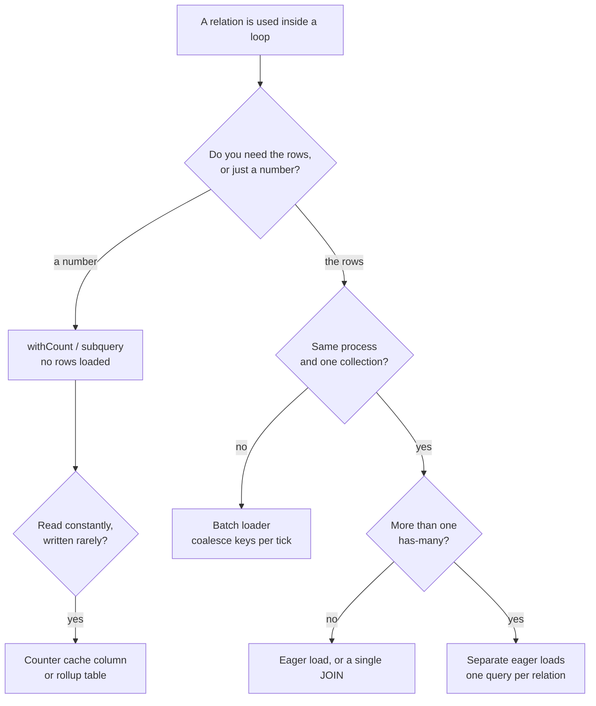

The scenario is one every backend engineer meets, usually in production rather than in
an interview:

> One product page. One database call, you'd assume. Loop over 200 related items — lazy
> loading quietly fires 200 more queries. Page takes 9 seconds to load. Nobody caught
> the query count in code review. It multiplied at runtime, not in the diff. What's the
> fix?

The name is the **N+1 query problem**: one query to fetch the parents, then one more per
parent to fetch a relation, so `N = 200` becomes **201 round trips**. The immediate fix
is eager loading, and if that were all there was to it this would be a two-line article.

The reason the question is worth asking is in the last sentence of the prompt. **The
query count is not visible in the code.** `$item->reviews` is a property access. Nothing
in the diff says "database call", nothing in review looks wrong, and the cost only
exists at runtime as a function of how many rows come back. So the real answer has two
halves: fix this page, then make the invisible thing visible enough that the next one
fails the build.

## Step 0: why 201 fast queries take nine seconds

Do the arithmetic first, because it points the fix in a direction most people find
surprising.

> **Napkin math:** 9,000 ms ÷ 201 queries ≈ **45 ms per query**.
>
> Where those 45 ms go on a typical request:
>
> - network round trip to the database (cross-AZ, TLS, pool checkout): **~5–20 ms**
> - parse, plan and execute a trivial indexed lookup: **~0.5–2 ms**
> - hydrating one row into an ORM model object: **~1–5 ms**
> - plus, on a busy pool, the wait to get a connection at all
>
> Total **database CPU** for the whole page might be **under 200 ms**. The other ~8.8
> seconds is 201 serialised waits.

That is the fact worth carrying into the fix: **the database is not slow, and the queries
are not slow.** This is why the slow query log is empty and why the DBA says the server
is idle. Every individual query is fine; there are simply 201 of them, and they happen
one after another because each one's result is needed before the loop advances.

So the fix is not an index, not a bigger instance, and not a faster query. It is
**fewer round trips**. Latency you cannot overlap is the cost, and the only way to
remove it is to stop paying it per item.

```flow
title: Where the nine seconds actually goes
packets: on

scenario "Lazy loading (201 round trips)"
> Each iteration blocks on its own query. The waits are serialised, so they add up.
App [render loop] --> DB (SELECT * FROM products WHERE id = ?) {neutral}
DB --> App (1 product) {allowed}
App --> DB (SELECT ... WHERE product_id = ? x 200) {blocked}
DB [idle, each query <2ms] --> App (200 results, one at a time) {blocked}
App --> User (page after ~9s) {blocked}
> Total DB CPU under 200ms. The rest is 201 network waits in a row.

scenario "Eager loading (2 round trips)"
> The ORM collects every id first, then fetches the whole relation in one statement.
App --> DB (SELECT * FROM products WHERE id = ?) {neutral}
DB --> App (1 product + its 200 item ids) {allowed}
App --> DB (SELECT ... WHERE product_id IN (200 ids)) {secure}
DB --> App (all rows, one result set) {allowed}
App --> User (page after ~120ms) {allowed}
> Same rows, same data, two waits instead of two hundred.
```

## Step 1: prove it, don't guess it

Before fixing, measure — both because you need the baseline and because "which relation
is lazy" is not obvious in a template three layers deep.

**Count the queries per request.** Every framework can do this; the point is to have the
number, per endpoint, in front of you.

```php
// Laravel: dump the count and the offending SQL for one request
DB::listen(function ($query) {
    Log::debug($query->sql, ['bindings' => $query->bindings, 'ms' => $query->time]);
});
```

**Find the repeated digest at the database.** N+1 has an unmistakable signature: one
statement shape executed hundreds of times with a tiny average latency.

```sql
-- MySQL: the same normalised query, executed 200 times, each one fast
SELECT digest_text,
       count_star,
       ROUND(avg_timer_wait / 1e9, 2) AS avg_ms
FROM   performance_schema.events_statements_summary_by_digest
ORDER  BY count_star DESC
LIMIT  10;
```

```sql
-- PostgreSQL: same idea via pg_stat_statements
SELECT calls, ROUND(mean_exec_time::numeric, 2) AS avg_ms, query
FROM   pg_stat_statements
ORDER  BY calls DESC
LIMIT  10;
```

> [!TIP]
> The tell is **high `calls`, low `avg_ms`**. Engineers instinctively sort by total time
> or by slowest query, which is exactly the sort order that hides an N+1. Sort by call
> count.

Tooling per stack, all doing the same job: Laravel Telescope or Debugbar, Rails' `bullet`
gem, Django Debug Toolbar, Prisma's query event log, and any APM whose trace view shows
the staircase of identical spans.

## Step 2: eager load — the fix for this page

The ORM already knows how to batch: collect the parent keys, issue one `IN` query, then
attach the results in memory.

```php
// Before: 1 + 200 queries
$product = Product::find($id);
foreach ($product->relatedItems as $item) {
    echo $item->reviews->count();   // <- a query, every iteration
}

// After: 2 queries
$product = Product::with('relatedItems.reviews')->find($id);
```

What the ORM actually runs is not magic, and it is worth being able to write by hand,
because that is what you fall back to when the ORM cannot express your case:

```sql
-- query 1: the parents
SELECT * FROM related_items WHERE product_id = 42;

-- query 2: every child, for every parent, in one statement
SELECT * FROM reviews WHERE related_item_id IN (1, 2, 3, /* … */ 200);
```

Two queries. Same data. The `IN` list costs the database almost nothing — it is one
index range scan per key against an index that already exists.

**Nested relations batch too**, one query per level rather than one per row:

```php
Product::with([
    'relatedItems.reviews.author',   // 4 queries total, not 1 + 200 + 2,000
])->find($id);
```

## Step 3: don't load rows you only wanted to count

Half of real N+1s are not "show the reviews" — they are "show the review **count**".
Loading 200 collections into memory to call `count()` on them is the same round-trip bug
plus a memory problem.

```php
// Wrong twice: N+1 queries, and 200 collections hydrated to produce 200 integers
$item->reviews->count();

// One query for the parents, with the counts computed in a subquery
$items = RelatedItem::withCount('reviews')->get();
$items->first()->reviews_count;

// Same family, same trick
RelatedItem::withSum('reviews', 'rating')->withAvg('reviews', 'rating')->get();
```

If you need a slice rather than a count — "the three newest reviews per item" — be
careful, because this is where a natural-looking constrained eager load is silently
wrong:

> [!WARNING]
> A `limit()` inside a constrained eager load applies to the **whole batched query**, not
> to each parent. `with(['reviews' => fn ($q) => $q->latest()->limit(3)])` fetches three
> reviews in total, then attaches them to whichever parents they happened to belong to.
> Some ORM versions now special-case this; do not assume yours does — check the SQL.

The portable fix is a window function, which is one query and correct by construction:

```sql
SELECT * FROM (
    SELECT r.*,
           ROW_NUMBER() OVER (PARTITION BY r.related_item_id ORDER BY r.created_at DESC) AS rn
    FROM   reviews r
    WHERE  r.related_item_id IN (1, 2, 3 /* … */)
) ranked
WHERE rn <= 3;
```

PostgreSQL users have a second option that often plans better: a `LATERAL` join, which
runs the "top 3 for this parent" subquery once per parent inside a single statement.

## Step 4: know when a JOIN is the wrong answer

The instinct after learning about N+1 is to collapse everything into one query. That is
sometimes right and sometimes catastrophic.

One `JOIN` is correct when you want a **flat projection** — a report, an export, a list
where each row is genuinely one row. It is wrong when you join **two `hasMany`
relations at once**, because the result set becomes their product:

> **Napkin math:** a product with 200 items × 12 images × 8 reviews joined in one
> statement returns **19,200 rows** to express 220 objects. The database sorts and ships
> all of it; the ORM then de-duplicates it in application memory.

That is the **cartesian explosion**, and it is how an N+1 fix turns into an out-of-memory
error. The rule of thumb:

| Situation                  | Right shape                             |
| -------------------------- | --------------------------------------- |
| One-to-one / belongs-to    | `JOIN` (no row multiplication)          |
| One has-many               | Either — join if you want flat rows     |
| Two or more has-many       | **Separate queries** (one per relation) |
| You only need an aggregate | Subquery / `withCount`, no row loading  |
| Deep nesting (3+ levels)   | One batched query per level             |

Two queries beating one query is not a paradox. **The cost is round trips _and_ rows
shipped, and a bad join optimises the first by exploding the second.**

## Step 5: the same bug one layer up — batch loaders

Eager loading works because the ORM can see the whole collection before it needs the
relation. In a GraphQL resolver, an API serialiser or a service call, it cannot: each
item is resolved independently, so you are back to one call per item — this time over
HTTP, which is worse.

The general form of the fix is a **batch loader**: collect the keys requested during one
tick of the event loop, issue one query for all of them, hand each caller its slice.

```ts
// DataLoader: 200 independent .load() calls collapse into one batched query
const reviewsByItem = new DataLoader<number, Review[]>(async (itemIds) => {
    const rows = await db
        .selectFrom('reviews')
        .where('related_item_id', 'in', [...itemIds])
        .selectAll()
        .execute();

    const grouped = Map.groupBy(rows, (r) => r.related_item_id);
    // The contract: return one entry per key, in the same order as `itemIds`.
    return itemIds.map((id) => grouped.get(id) ?? []);
});

// Each resolver still asks for its own item, and still gets one query for all of them.
const reviews = await reviewsByItem.load(item.id);
```

Two rules make this work, and both are easy to get wrong: the batch function must return
**exactly one entry per key in the same order** as it received them, and the cache must
be **per request**, or one user's data leaks into another's response.

The same pattern applies to `MGET` against Redis instead of 200 `GET`s, one bulk API call
instead of 200 HTTP requests, and one `IN` query instead of 200 lookups in a job.
**Whenever a boundary is crossed inside a loop, batch the boundary.**

## Step 6: when the query itself should not exist

Sometimes the honest answer is that the page is asking for too much.

- **Paginate.** "200 related items" on one page is usually a product decision nobody
  revisited. Showing 12 with a link makes the query 16× cheaper and the page faster for
  reasons that have nothing to do with SQL.
- **Counter cache.** If `reviews_count` is read on every page view and written rarely,
  store it as a column, updated in the same transaction as the write. One column read
  beats any subquery.
- **Cache the composed payload.** For a read-heavy page with tolerable staleness, cache
  the assembled view model, not the individual rows — and jitter the TTL.
- **Materialised view / rollup table.** When the aggregate is expensive and read
  constantly, precompute it on a schedule.



## Step 7: make the query count fail the build

This is the part the prompt is really about. Everything above fixes _this_ page; none of
it stops the next one, because the next one will also look fine in review.

**Turn lazy loading into an exception outside production.** This is the single highest-value
change in the whole article: it converts an invisible performance bug into a loud test
failure at the moment someone writes it.

```php
// AppServiceProvider::boot()
Model::preventLazyLoading(! $this->app->isProduction());

// Optional: report instead of throwing, if you need a migration period
Model::handleLazyLoadingViolationUsing(function (Model $model, string $relation) {
    Log::warning("Lazy loaded [{$relation}] on [" . $model::class . ']');
});
```

Rails has `strict_loading` on associations and the `bullet` gem; Django has
`select_related`/`prefetch_related` with assertions available through
`django-debug-toolbar`. The mechanism differs; the principle does not.

**Assert the query count in tests.** A page's query count is a contract. Write it down.

```php
public function test_product_page_stays_at_two_queries(): void
{
    $product = Product::factory()->hasRelatedItems(200)->create();

    $this->expectsDatabaseQueryCount(2);          // Laravel ships this assertion
    $this->get("/products/{$product->id}")->assertOk();
}
```

If your framework has no such helper, ten lines of `DB::listen` gives you one — and
crucially, **seed enough rows in the test that an N+1 would actually show up.** A test
fixture with two related items makes 1+2 and 2 look identical, which is why so many N+1s
ship green.

**Budget it in CI and watch it in production.** Log a query count per request, alert when
an endpoint's p95 count moves, and treat a jump from 2 to 201 as a regression with the
same seriousness as a failing test. The number is cheap to collect and it is the only
signal that catches the N+1s introduced by a template change three modules away.

## Before and after

| Metric              | Lazy loading | Eager loading   |
| ------------------- | ------------ | --------------- |
| Queries per request | 201          | 2               |
| Wall clock          | ~9.0 s       | ~0.12 s         |
| Database CPU        | ~200 ms      | ~150 ms         |
| Rows shipped        | ~equal       | ~equal          |
| Visible in the diff | No           | Yes (`with(…)`) |

Note the third row. The database was never the bottleneck, which is why this is a
_latency_ fix rather than a _database_ fix — and why "add an index" or "scale up the
instance" would have changed nothing.

## The one-paragraph answer

If the interviewer wants it in thirty seconds: _That's the N+1 query problem — one query
for the parents plus one per item, so 201 round trips. The important detail is that each
query is fast; the database CPU for the whole page is a couple of hundred milliseconds,
and the nine seconds is 201 serialised network waits, which is why the slow log is empty.
So the fix is fewer round trips, not a faster query: eager load the relation so the ORM
issues one `WHERE id IN (…)` for all 200, use `withCount` where I only need an aggregate,
and use separate eager loads rather than one big join when two has-many relations are
involved, or the result set multiplies. Across a service or a GraphQL resolver I'd use a
per-request batch loader to coalesce the keys instead. Then the part that actually
matters: query count is invisible in review because it's a runtime property, so I'd turn
lazy loading into an exception outside production, assert the query count in a test seeded
with enough rows for an N+1 to show, and track queries-per-request in production so the
next regression fails the build instead of the page._

## What the question is really testing

The product page is a prop. The transferable moves:

1. **Attribute the time before optimising it.** 201 × 45 ms is a latency problem wearing
   a database costume; the fix follows from where the time actually is.
2. **Batch at the boundary, not inside the loop.** Database, cache, HTTP, filesystem —
   the same shape, the same fix.
3. **Know when one query is worse than two.** Cartesian explosion is the standard
   over-correction, and it fails at a bigger scale than the bug it replaced.
4. **Make invisible costs visible.** Anything that only exists at runtime must be
   converted into something a test or a linter can see, or review will keep missing it.
5. **Fix the class, then the instance.** The page took an hour. The `preventLazyLoading`
   line stops every future one, and it is one line.

The same five apply to a serialiser that fetches an avatar per row, a job that calls an
API per record, and a template that hits Redis per widget. The product page is just where
they are easiest to count.
