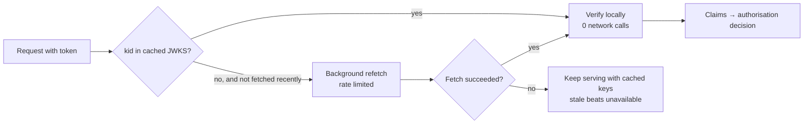

The question is short, and the fun of it is that the premise sounds impossible:

> Your authentication service is down. Yet users are still logging in successfully. No
> cached sessions. No fallback service. How?

The answer is one sentence: **the auth service is on the issuance path, not the
verification path.** It mints credentials; it does not check them. Checking happens
inside each API process, using a public key it already has, with **zero network calls**.
So an outage of the issuer is invisible to every request that arrives holding a token
that was minted before it died.

That is the answer. The rest of this article is the part that separates a good answer
from a memorised one: what "logging in" actually means, what is _already_ broken while
you are saying "everything looks fine", how long the illusion lasts, and what you gave
up to get it.

## Step 0: separate the four events people call "logging in"

Most of the confusion in this question comes from one overloaded word. Four different
things happen in an auth system, and only some of them need the auth service alive.

| Event                         | What it does                                 | Needs the auth service? |
| ----------------------------- | -------------------------------------------- | ----------------------- |
| **Authentication (issuance)** | Check a password/MFA, mint a token           | **Yes**                 |
| **Verification**              | Confirm this token is genuine and unexpired  | **No** — local          |
| **Refresh**                   | Trade a refresh token for a new access token | Usually yes             |
| **Authorisation**             | Decide what this identity may do             | No — claims in token    |

A user who already holds a valid access token and reloads the app sees a session that
works, a name in the corner and a full dashboard. To them, and to your support inbox,
that is "logged in". No credential was checked; a signature was.

> [!IMPORTANT]
> If your monitoring cannot distinguish "issuing tokens" from "accepting tokens", you
> will report this outage as a non-event and discover its real size hours later, when
> the first cohort of tokens expires. Instrument the two separately.

## Step 1: why verification needs no network call

A JWT (more precisely a JWS) is three base64url segments: `header.payload.signature`.
The header names the algorithm and the key id; the payload carries the claims; the
signature covers the first two.

With an **asymmetric** algorithm — `RS256`, `ES256`, `EdDSA` — the issuer signs with a
private key that never leaves it, and every API verifies with the matching **public**
key. Public keys are, by definition, safe to copy everywhere.

```ts
import { jwtVerify, createLocalJWKSet } from 'jose';

// Fetched once at boot and refreshed in the background — not per request.
const jwks = createLocalJWKSet(cachedJwksDocument);

export async function verify(token: string) {
    const { payload } = await jwtVerify(token, jwks, {
        issuer: 'https://auth.example.com',
        audience: 'api.example.com',
        clockTolerance: 30 // seconds, for modest clock skew between nodes
    });
    return payload; // sub, scopes, exp — everything the request needs
}
```

Everything that call checks — signature, `iss`, `aud`, `exp`, `nbf` — is computable from
the token plus a key already in memory. That is the entire trick. **A request that needs
no I/O to authorise cannot be broken by a service being down.**

```flow
title: Two designs, one dead auth service
packets: on

scenario "Stateless verification (what is happening)"
> The token proves itself. The issuer is not consulted, so its state is irrelevant.
Client [holds a JWT] --> API (Authorization: Bearer …) {neutral}
API [has the public key] --> API (verify signature + exp, in process) {secure}
API --> DB (do the actual work) {allowed}
API --> Client (200 OK) {allowed}
Auth [DOWN] --> API (never contacted on this path) {blocked}
> Zero round trips to auth. The outage is invisible until tokens start expiring.

scenario "Opaque token / session lookup"
> The token is a random string, so its meaning lives in the issuer's store.
Client [holds a session id] --> API (Authorization: Bearer …) {neutral}
API --> Auth (introspect this token) {neutral}
Auth [DOWN] --> API (timeout) {blocked}
API --> Client (401 or 503 for everyone) {blocked}
> The auth service is on the request path, so its availability is your availability.
```

The contrast is the whole design decision. **Stateless tokens move auth off the request
path; opaque tokens keep it on.** Everything else — revocation, latency, blast radius —
follows from that one choice.

## Step 2: be precise about what is already broken

This is where a candidate earns the offer, because "users are still logging in" is only
true for one meaning of the phrase. While the issuer is down:

| Still works                                         | Already broken                              |
| --------------------------------------------------- | ------------------------------------------- |
| Any request with an unexpired access token          | Brand-new logins with a password            |
| Authorisation from claims already in tokens         | MFA challenges and step-up auth             |
| Service-to-service calls with cached tokens         | Refresh, once access tokens start expiring  |
| Verification after a JWKS fetch failure (if cached) | Signup, password reset, email verification  |
| Anything signed with a key you already hold         | Revocation, logout-everywhere, role changes |

So the honest framing is: **the system is in a slow-motion outage.** Right now the blast
radius is "people who have not logged in for a while". In fifteen minutes — or whatever
your access token TTL is — it becomes everyone whose token expired, all at once.

> [!WARNING]
> Expiry is a scheduled cliff. If tokens were issued in a burst (a deploy, a morning
> peak) they expire in a burst too, and every client hits `/token` at the same instant
> the moment the issuer returns. That is a cache stampede wearing an auth costume, and
> the fix is the same: **jitter the token lifetime** so expiries spread out, and make
> clients back off with full jitter rather than retrying on a fixed timer.

## Step 3: rule out the boring explanations first

Before congratulating your architecture, check that the premise is true. "The auth
service is down" is a claim from a dashboard, and dashboards lie in specific ways:

1. **The health check is measuring the wrong thing.** `/health` hits the admin API or a
   dependency the token endpoint never touches. Token issuance may be perfectly healthy.
2. **Only one instance, AZ or region is down.** Your alert fires on a cluster; DNS or a
   load balancer quietly routes users to the survivors.
3. **Identity is delegated.** If login is OIDC against Google, Okta or Auth0, your
   service is not the identity provider — the IdP completes the flow, and your API
   accepts its token. Your "auth service" was a config file.
4. **A different path issues credentials.** Long-lived API keys, mTLS, an admin bypass, a
   legacy endpoint on another host.
5. **The client is refreshing silently.** SDKs refresh in the background; users report
   "logging in fine" when they have not actually authenticated in weeks.

The diagnostic that settles it in one minute: **look for issuance events, not request
success.** If the token endpoint's success count is zero while API 200s are flat, you
have the stateless case above. If it is non-zero, something is still issuing, and
question 1 is _what_.

## Step 4: the trade you made — revocation

Nothing here is free. A token that can be verified without asking anyone is also a token
**nobody can un-issue**. Fire someone, and their access token stays valid until it
expires. That is the same property that makes the outage invisible; you cannot keep one
and drop the other.

The available positions, in ascending order of how much statelessness you give back:

| Strategy                                      | Revocation delay            | Cost when auth is down            |
| --------------------------------------------- | --------------------------- | --------------------------------- |
| Short access TTL (5–15 min) + refresh         | ≤ one TTL                   | Outage becomes visible in one TTL |
| `token_version` claim vs a cached user record | Until the cache refreshes   | Needs a store; can serve stale    |
| Denylist of `jti` in Redis                    | Immediate                   | Redis is now on the request path  |
| Introspection on every request                | Immediate                   | Auth is fully on the request path |
| Sensitive-action re-auth (step-up)            | Immediate, where it matters | None — the check is scoped        |

The design most teams land on is the last row combined with the first: **short-lived
access tokens for everything, plus a real check at the moments that matter** — changing
a password, moving money, granting access. Reads stay stateless and available; dangerous
writes are allowed to fail closed.

That framing is worth stating explicitly in an interview, because it shows you know this
is a policy question rather than a technology one: _availability and revocation latency
are the same dial, and different endpoints deserve different settings._

## Step 5: what actually keeps this working — JWKS caching

The one network dependency left in verification is fetching the issuer's public keys
from its JWKS endpoint, usually `/.well-known/jwks.json`. Handle it badly and you have
quietly rebuilt the coupling you were avoiding.

The rules:

- **Fetch at boot, refresh in the background**, never inside a request. A synchronous
  JWKS fetch on a cache miss puts the auth service back on the request path at the worst
  possible moment.
- **Serve stale on error.** If the refresh fails, keep using the keys you have. Keys
  change rarely; availability matters constantly. A JWKS cache that hard-fails is a
  single point of failure with extra steps.
- **Refetch on an unknown `kid`, but rate-limit it** — otherwise a malformed token from
  one client turns into a JWKS stampede.
- **Rotate in the right order:** publish the new public key, wait longer than your cache
  TTL, _then_ start signing with it, and only retire the old key after the last token it
  signed has expired. Getting this backwards is the classic 3 a.m. incident: every API
  rejecting valid tokens because the key that signed them is not in its cache yet.



## Step 6: design the degradation on purpose

If this behaviour was an accident, it is luck. Make it a decision:

- **Keep verification I/O-free.** Every dependency you add to the auth check — a session
  lookup, a permission service, a feature flag call — is a service whose outage becomes
  your outage.
- **Put authorisation data in the token,** with a TTL short enough that changes propagate
  acceptably. Roles and scopes as claims cost bytes; as lookups they cost availability.
- **Decide fail-open vs fail-closed per endpoint, in writing.** Reads and browsing
  degrade open; payments, permission changes and data export fail closed. The default
  should be explicit, not whatever the HTTP client's timeout does.
- **Give the issuer its own availability budget:** multiple instances, multiple AZs,
  read replicas of the user store, and a token endpoint that does not share a pool with
  the admin API.
- **Practise the outage.** Turn the issuer off in staging and watch what breaks at
  minute 0, minute 15 and minute 60. The failure profile is a curve, not an event, and
  nobody knows its shape until they have measured it.
- **Alert on issuance, not just on 5xx.** A drop in successful token issues with flat
  API traffic is precisely this incident, and it is the only signal that catches it
  before the expiry cliff.

## The one-paragraph answer

If the interviewer wants it in thirty seconds: _Because the auth service is only on the
issuance path. The tokens are stateless JWTs signed with an asymmetric key, so every API
verifies the signature, issuer, audience and expiry in process using a public key it
fetched from JWKS at boot — zero network calls, so the issuer's state is irrelevant to a
request. What's actually happening is that people with unexpired tokens are still
authorised; nobody can complete a genuine password login right now. So it's a slow-motion
outage: the blast radius is small until access tokens start expiring, then it's everyone
at once — and if tokens were issued in a burst they expire in a burst, which stampedes
the token endpoint the moment it comes back. I'd also check the premise, since a
health-check measuring the wrong endpoint or an external IdP explains it just as well.
And I'd name the trade: the same property that keeps requests flowing means I can't
revoke a token, so the usual design is short TTLs plus a real check on sensitive actions,
with JWKS cached stale-on-error so verification never depends on the issuer being up._

## What the question is really testing

The auth outage is a prop. The transferable moves:

1. **Know which dependencies are on the request path.** A service being down only matters
   if a request has to talk to it; most availability design is moving things off that
   path.
2. **Distinguish issuing a credential from checking one.** Minting is centralised by
   necessity; checking is distributable by cryptography.
3. **Describe outages as curves, not events.** "Nothing is broken yet" and "everything
   breaks in fifteen minutes" are the same incident at two points in time.
4. **Name the trade you made.** Statelessness buys availability with revocation latency;
   the right answer is a per-endpoint policy, not a global one.
5. **Check the premise.** Half of "impossible" behaviour is a monitoring artefact, and
   confirming it costs one query.

The same five apply to a feature-flag service, a config store or a licence checker: put
the answer in something the request already carries, and the dependency stops being able
to take you down.
