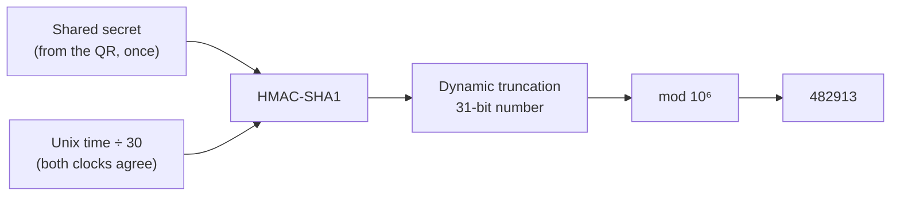

The question sounds like a trick, and the fun of it is that nothing about it is:

> Your phone is in airplane mode. You open Google Authenticator and it generates a valid
> 6-digit code. No internet. No Wi-Fi. No signal. You enter it on a website, and the
> server instantly knows whether it's correct. How does the server know the code your
> phone generated?

The answer in one sentence: **the code was never transmitted, so it never needed a
network — it was _derived_, independently, on both sides, from two things they already
share.** Those two things are a **secret** (exchanged exactly once, when you scanned the
QR code) and the **current time**.

That's it. The phone is not communicating with anything. It is evaluating a pure
function. The server evaluates the same function with the same inputs and gets the same
answer. The mechanism has a name and a spec: **TOTP, RFC 6238** — Time-based One-Time
Password.[^rfc]

## Step 0: the only moment data ever moves

Every confusion about TOTP dissolves once you separate the two phases. They happen years
apart and only one of them involves a network.

| Phase              | When           | What crosses the wire                                         |
| ------------------ | -------------- | ------------------------------------------------------------- |
| **Enrolment**      | Once, at setup | The **shared secret**, inside the QR code                     |
| **Authentication** | Every login    | Only the **6 digits you type**, from your fingers to the site |

The QR code is not a picture of your account. It is a URI carrying a random secret the
server just generated:

```text
otpauth://totp/Example:kzaman@example.com
  ?secret=JBSWY3DPEHPK3PXP      # base32 of the raw secret, 160 bits recommended
  &issuer=Example
  &algorithm=SHA1               # RFC default
  &digits=6
  &period=30
```

Your phone stores that secret in its keychain and never asks for it again. The server
stores its copy next to your user record. **From that moment on, both parties hold the
same secret and have no further need to talk.**

Note carefully what the phone does _not_ have: your password, an account session, or any
connection to the site you are logging into. Google Authenticator has no idea what
happens to the digits it shows you.

```flow
title: Enrolment vs authentication
packets: on

scenario "Enrolment (once, needs a network)"
> The only time the secret exists on the wire. After this, the two sides are independent.
Server [generates 160-bit secret] --> Screen (otpauth:// QR code) {secure}
Screen --> Phone (scan, store in keychain) {secure}
Phone --> Server (first code, to prove the scan worked) {secure}
Server --> DB (store secret encrypted, mark MFA enabled) {allowed}
> Both sides now hold the same secret. Nothing else is ever exchanged.

scenario "Authentication (every login, needs nothing)"
> Two independent computations of the same pure function. Airplane mode is irrelevant.
Phone [offline] --> Phone (HMAC(secret, T) -> 482913) {secure}
User --> Browser (types 482913) {neutral}
Browser --> Server (POST /mfa 482913) {neutral}
Server [same secret, own clock] --> Server (HMAC(secret, T) -> 482913) {secure}
Server --> User (match: session granted) {allowed}
> The phone never talked to the server. It did not have to.
```

## Step 1: the algorithm, exactly

TOTP is HOTP (RFC 4226, a counter-based one-time password) with the counter replaced by
a number derived from the clock. Four steps.

**1. Turn the time into a counter.** Both sides compute the same integer, because both
use Unix time — a shared, absolute reference:

```text
T = floor((unix_seconds - T0) / X)      T0 = 0, X = 30 seconds
```

Every 30 seconds `T` increments, on every device on Earth, simultaneously. This is the
part that makes the whole scheme work: **no coordination is needed because both sides
already agreed to use the same clock.**

**2. HMAC the counter with the secret.** `T` is encoded as an 8-byte big-endian integer:

```text
mac = HMAC-SHA1(secret, T_as_8_bytes)     // 20 bytes
```

**3. Dynamic truncation** — squeeze 20 bytes into a 31-bit number, using the last nibble
of the MAC to choose _where_ to read from:

```text
offset = mac[19] & 0x0f                  // 0–15
code   = ((mac[offset]   & 0x7f) << 24)
       | ((mac[offset+1] & 0xff) << 16)
       | ((mac[offset+2] & 0xff) <<  8)
       |  (mac[offset+3] & 0xff)
```

That `& 0x7f` on the first byte clears the top bit, so the result is unambiguously
positive in languages with signed 32-bit integers — a spec detail that exists purely to
stop implementations disagreeing.

**4. Modulo down to six digits**, zero-padded:

```text
otp = code % 1_000_000                   // 000000–999999
```

Written out, the whole thing is about fifteen lines:

```ts
import { createHmac } from 'node:crypto';

export function totp(secret: Buffer, at = Date.now(), step = 30, digits = 6): string {
    const counter = Math.floor(at / 1000 / step);

    // The counter as a big-endian 64-bit integer — the input both sides agree on.
    const buf = Buffer.alloc(8);
    buf.writeBigUInt64BE(BigInt(counter));

    const mac = createHmac('sha1', secret).update(buf).digest();

    // Dynamic truncation: the low nibble of the last byte picks the 4-byte window.
    const offset = mac[mac.length - 1]! & 0x0f;
    const binary =
        ((mac[offset]! & 0x7f) << 24) |
        ((mac[offset + 1]! & 0xff) << 16) |
        ((mac[offset + 2]! & 0xff) << 8) |
        (mac[offset + 3]! & 0xff);

    return String(binary % 10 ** digits).padStart(digits, '0');
}
```

The server runs that exact function. Same secret, same `T`, same six digits. **There is
no channel because there is nothing to send.**



> [!NOTE]
> HMAC-SHA1 here is not a security weakness. SHA-1's broken property is _collision
> resistance_, which HMAC does not rely on; HMAC-SHA1 remains sound. RFC 6238 permits
> SHA-256 and SHA-512, but many authenticator apps historically ignored the `algorithm`,
> `digits` and `period` parameters and assumed SHA1/6/30 — so changing them is an
> interoperability decision more than a security one.

## Step 2: the clocks are never exactly right

Two independent clocks will not agree to the millisecond, and a user takes several
seconds to read six digits and type them. So verification checks a small **window** of
time steps, not just the current one:

```ts
export function verify(secret: Buffer, submitted: string, window = 1): number | null {
    const now = Date.now();
    for (let drift = -window; drift <= window; drift++) {
        const candidate = totp(secret, now + drift * 30_000);
        // Constant-time compare: never leak how much of the code matched.
        if (timingSafeEqualStr(candidate, submitted)) return Math.floor(now / 30_000) + drift;
    }
    return null;
}
```

A `window` of 1 accepts the previous, current and next step — roughly ±30 seconds. That
is the standard setting, and the trade is explicit:

| Window | Codes valid at once | Tolerates     | Guess probability per attempt |
| ------ | ------------------- | ------------- | ----------------------------- |
| 0      | 1                   | nothing       | 1 in 1,000,000                |
| 1      | 3                   | ±30 s skew    | 3 in 1,000,000                |
| 5      | 11                  | ±2.5 min skew | 11 in 1,000,000               |

Widening the window is the lazy fix for "users complain codes don't work". The correct
fix is usually **NTP on your servers**, since the phone's clock is set by the carrier or
the OS and is rarely the problem. (This is also why authenticator apps offer a "time
correction for codes" setting: they store a one-time offset against a network time
source and keep using it offline.)

## Step 3: the two things the algorithm does not do for you

The RFC gives you code generation. It does not give you a secure login. Two pieces are
yours to build, and both are commonly missed.

**Replay prevention.** A code is valid for the whole window, so an attacker who sees it
— over your shoulder, in a screenshot, through malware — can reuse it seconds later. The
spec is explicit that a verifier must accept each one-time password **only once**. That
means storing the last accepted time step per user and rejecting anything at or below it:

```ts
const step = verify(secret, submitted);
if (step === null) return reject('invalid');

// One-use enforcement, atomic so two concurrent logins cannot both win.
const isNew = await redis.set(`totp:${userId}:${step}`, '1', 'NX', 'EX', 90);
if (!isNew) return reject('code already used');
```

Note what this means architecturally: **generation is stateless and verification is
not.** The code check needs no coordination, but "has this code been used" is shared
state across every server that can accept a login. It is a small amount of state with a
90-second lifetime — but it is state, and getting it wrong is the difference between MFA
and theatre.

**Rate limiting.** Six digits is a 10⁶ space, and with a ±1 window three of those are
valid at any instant.

> **Napkin math:** probability of a blind guess ≈ **3 in 1,000,000**.
>
> - Unlimited attempts at 50/second: expected success in **under two hours**.
> - Capped at 5 attempts per code period, then exponential lockout: **effectively never**,
>   and you get an alert instead of a breach.

So: strict per-user attempt limits, exponential backoff, lockout with notification, and
per-IP limits on top. Without them, the six digits are decoration.

## Step 4: what TOTP protects against — and what it doesn't

Being precise here is what separates "I've integrated an MFA library" from "I understand
the threat model".

| Attack                                 | Does TOTP stop it? | Why                                                             |
| -------------------------------------- | ------------------ | --------------------------------------------------------------- |
| Stolen or reused password              | **Yes**            | The password alone is not enough                                |
| Credential-stuffing from a breach dump | **Yes**            | Dumps contain no valid current code                             |
| SIM swap / SS7 interception            | **Yes**            | Nothing is sent over the carrier at all                         |
| Passive network eavesdropping          | **Yes**            | The code is single-use and expires in ~30 s                     |
| **Real-time phishing (AitM proxy)**    | **No**             | The user hands a live code to a proxy that replays it instantly |
| Malware on the phone                   | **No**             | It can read the secret out of the app                           |
| Server database compromise             | **No**             | Secrets are symmetric — the server holds a working copy         |

The two "no" rows drive real design decisions:

- **Encrypt the secrets at rest**, with a key from a KMS or HSM, not in the same database
  they sit in. A leak of the `users` table is a leak of every second factor. And never
  log them, never put them in an error report, never return them from an API after
  enrolment.
- **Phishing resistance requires origin binding**, which TOTP structurally cannot do — the
  six digits do not know which site they are typed into. That is precisely the gap
  **WebAuthn/passkeys** close, because the authenticator signs a challenge bound to the
  origin, so a proxy on `exarnple.com` cannot use it. TOTP is a large improvement over
  SMS and passwords alone; it is not the end state.

Compared with the alternatives:

| Factor              | Needs network on the device | Phishing-resistant | Notable weakness             |
| ------------------- | --------------------------- | ------------------ | ---------------------------- |
| SMS OTP             | Yes (carrier)               | No                 | SIM swap, SS7, delivery cost |
| **TOTP**            | **No**                      | No                 | Shared secret, AitM proxy    |
| Push approval       | Yes                         | Partly             | Prompt-bombing fatigue       |
| WebAuthn / passkeys | No (for the signature)      | **Yes**            | Recovery, device loss        |

## Step 5: getting the implementation details right

The parts that bite in production, in the order they usually bite:

- **Generate the secret with a CSPRNG**, 160 bits (20 bytes) as RFC 4226 recommends, and
  base32-encode it for the QR. Never derive it from anything user-related.
- **Confirm enrolment with a code** before enabling MFA. If the scan silently failed,
  you have just locked the user out of their own account.
- **Issue recovery codes** at enrolment, single-use, stored **hashed** exactly like
  passwords. This is the actual account-recovery path, and it needs the same care.
- **Compare in constant time** and give one generic error for both wrong and expired
  codes.
- **Show the remaining seconds** in the UI. Half of "invalid code" reports are a user
  typing a code that expired mid-entry.
- **Rate limit before you verify**, so an attacker cannot use timing or error text to
  distinguish states.

## The one-paragraph answer

If the interviewer wants it in thirty seconds: _Because the code isn't transmitted — it's
derived on both sides from two things they already share. When I scanned the QR at
enrolment, the server handed my phone a random secret; that was the only time anything
crossed the wire. After that, both sides compute `T = floor(unix_time / 30)`, take
`HMAC-SHA1(secret, T)`, apply dynamic truncation to get a 31-bit number and mod it to six
digits. Same secret plus same time step means the same code, so the phone needs no
network — it's evaluating a pure function. The server checks a small window of steps,
usually ±1, to absorb clock skew and typing time. Two things the algorithm doesn't give
you: it must store the last accepted step to stop replay, since the code is valid for the
whole window, and it needs strict rate limiting because six digits with a ±1 window is
only three-in-a-million per guess. And the honest caveat: TOTP kills password reuse and
SIM-swap attacks but not real-time phishing, because the digits aren't bound to an
origin — that's what WebAuthn fixes._

## What the question is really testing

The airplane mode is a prop. The transferable moves:

1. **Distinguish "shared once" from "shared continuously".** A one-time key exchange
   buys you unlimited offline agreement afterwards — the same idea behind session keys
   and signed tokens.
2. **Recognise a pure function.** Two parties computing `f(shared_secret, shared_clock)`
   need no channel. Time is the cheapest coordination primitive there is, because it is
   already synchronised globally.
3. **Know where the state actually is.** Generation is stateless; replay prevention is
   not. Naming which half needs shared storage is the systems half of the answer.
4. **Do the guess math.** 10⁶ with a 3-code window is a number you can reason about, and
   it tells you rate limiting is mandatory rather than optional.
5. **State the threat model honestly.** "TOTP stops these five attacks and not those two"
   is a better answer than "TOTP is secure", and it is the sentence that leads naturally
   to passkeys.

[^rfc]:
    TOTP is specified in RFC 6238, which builds directly on HOTP (RFC 4226) by replacing
    HOTP's monotonic counter with a time-derived one. RFC 6238 is also the source of the
    ±1 step verification-window guidance and of the requirement that a verifier accept a
    given one-time password only once.
