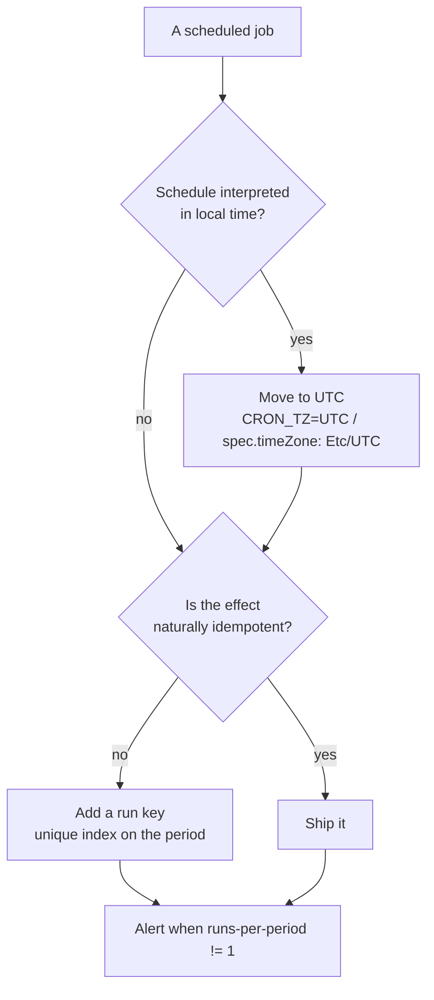

The question is good because it removes every explanation you would normally reach for:

> Your cron job runs exactly once every midnight. It has done so for 4 years. Today, it
> ran twice. Nobody deployed anything. Why?

No deploy, no config change, four years of evidence that the schedule is correct. So the
schedule _is_ correct — something under it changed. The prime suspect, and the answer
the question is fishing for, is a **daylight-saving fall-back: the clock stepped back an
hour, so the local time `00:00` happened twice, and a schedule written in local time
fired on both of them.**

That is the headline answer. But the interview continues after it, and the two follow-up
questions are the ones that matter: _how would you confirm that rather than assume it_,
and _what do you change so it cannot hurt you again_ — because the answer to the second
one is not "fix the schedule".

## Step 0: the reframe — cron is a trigger, not a transaction

Before the causes, the framing that makes all of them the same problem.

A scheduler's job is to _fire_. It has no idea what your job does, whether it finished,
or whether the effect it produced already existed. Every scheduler in common use gives
you **at-least-once** delivery at best, and several of them will happily give you
**at-most-once** in the other direction:

| Direction | When it happens                                                             |
| --------- | --------------------------------------------------------------------------- |
| **Twice** | Clock steps back, two schedulers, controller catch-up, retry                |
| **Never** | Clock steps forward over the slot, node down at the moment, missed deadline |

The spring-forward case is the mirror image of this question and just as real: at a
spring transition, `02:30` local **does not exist**, so a job scheduled then may never
run that day at all. Same schedule, same code, opposite failure.

So: **exactly-once is a property you build into the job, not a property you can buy from
a scheduler.** Everything below follows from that.

## Step 1: the daylight-saving mechanism, precisely

At a fall-back transition the local clock rewinds. In a zone where the transition is at
midnight, the sequence of local times is:

```text
23:58  23:59  00:00  00:01  …  00:58  00:59  00:00  00:01  …  01:00
                ▲                                    ▲
             run #1                               run #2
```

That day has **25 hours**, and the wall-clock label `00:00` is attached to two different
instants an hour apart in real time. A schedule expressed as "when the local clock reads
00:00" is therefore satisfied twice, exactly as written.

> [!NOTE]
> Most zones transition at 02:00 or 03:00 local, which is why the classic version of
> this bug hits jobs scheduled at 2 a.m. Zones that have historically transitioned at or
> near midnight — parts of South America among them — hit it at `0 0 * * *`. Which
> midnights repeat depends entirely on the tz database for the zone your host is in.

**Whether your scheduler double-fires is implementation-specific.** Some cron
implementations special-case fixed-time entries around DST shifts; others simply compare
the wall clock every minute and fire whenever it matches. Kubernetes `CronJob`,
systemd timers, Quartz, and every application-level scheduler have their own rules and
have changed them across versions. That variety is not trivia — it is the argument for
not depending on the behaviour at all.

```bash
# Does this zone have a transition near the job's time? Ask tzdata, don't guess.
zdump -v America/Sao_Paulo | grep 2026
TZ=America/Sao_Paulo date -d '2026-02-15 00:00:00'
```

## Step 2: the other eight suspects

DST is the best answer, not the only one. Each cause leaves a different fingerprint, and
naming the fingerprint is what turns a guess into a diagnosis.

| Cause                                        | What the evidence looks like                                                                                  |
| -------------------------------------------- | ------------------------------------------------------------------------------------------------------------- |
| **DST fall-back**                            | Two runs, same local time, **exactly 1 h apart in UTC**, twice a year                                         |
| **NTP step backwards**                       | A clock-step line in the time daemon's log; gap or overlap in unrelated logs                                  |
| **VM resume / snapshot restore / migration** | Host clock jump; hypervisor event at the same moment                                                          |
| **A second scheduler appeared**              | The two runs report **different hostnames or pod names**                                                      |
| **Duplicate schedule entries**               | Same host, two entries — one in `crontab`, one in `/etc/cron.d`, or both a timer and a cron line              |
| **Controller catch-up**                      | Kubernetes `CronJob` firing a missed slot after the controller returns, governed by `startingDeadlineSeconds` |
| **Persistent timer catch-up**                | `systemd` timer with `Persistent=true` running the missed slot at boot                                        |
| **Lost acknowledgement**                     | The job _succeeded_, the worker died before acking, the queue redelivered                                     |
| **Overlap, not repetition**                  | Yesterday's run took over 24 h; the two runs are **concurrent**, not sequential                               |

> [!TIP]
> The single most useful habit for this entire class of bug: **log timestamps in UTC and
> include the hostname.** Those two fields alone discriminate between DST (same local
> time, 1 h apart in UTC, same host) and a duplicate scheduler (same UTC time, different
> hosts) — which is most of the diagnosis, for free.

## Step 3: the ten-minute diagnosis

Work top-down; each step eliminates a group.

```bash
# 1. What were the two runs, in UTC and with hostnames?
#    Same local time + 1h apart in UTC  -> DST.  Same UTC + different host -> two schedulers.
grep 'daily-rollup' /var/log/app/*.log | awk '{print $1, $2, $3}'

# 2. Does this host's zone have a transition today?
timedatectl                       # what zone is the host actually in?
zdump -v "$(timedatectl show -p Timezone --value)" | grep "$(date +%Y)"

# 3. Did the clock jump for another reason?
journalctl -u chronyd -u systemd-timesyncd --since '2 days ago' | grep -iE 'step|jump|slew'
chronyc tracking

# 4. Is the schedule installed more than once?
crontab -l; ls -l /etc/cron.d/; systemctl list-timers --all | grep -i rollup

# 5. Is something else running the same job?
kubectl get cronjobs -A
```

The `TZ` question deserves its own note because it is the most common surprise: the
schedule may be interpreted in the **host's** zone, the **container's** zone, the
**scheduler's configured** zone, or the **application's** zone, and these disagree
constantly. A container that inherited `TZ` from a base image is how a job that was
"always UTC" quietly became local.

## Step 4: why a lock is not the fix

The reflex is to reach for a distributed lock. It is the right tool for a different
problem, and knowing the difference is the point of this step.

```php
// Prevents two runs from executing AT THE SAME TIME. Does nothing about a second run
// an hour later — by then the lock has been released and everything looks normal.
Cache::lock('daily-rollup', 3600)->get(function () {
    $this->rollup();
});
```

| Tool                     | Stops overlap | Stops a repeat an hour later |
| ------------------------ | ------------- | ---------------------------- |
| Distributed lock / mutex | **Yes**       | No                           |
| `flock` on a lockfile    | **Yes**       | No                           |
| Run key + unique index   | No            | **Yes**                      |
| Idempotent job body      | No            | **Yes** (harmlessly)         |

DST double-firing is sequential, not concurrent. So you need the bottom two rows —
ideally both, because they answer different questions: the run key stops the second
execution, the idempotent body means it wouldn't have mattered if it hadn't.

## Step 5: the actual fix — a run key with a unique index

Give every _logical_ occurrence a deterministic name, and let the database enforce that
it happens once. This is the same idempotency-key pattern used for payments, applied to
schedules.

```sql
CREATE TABLE job_runs (
    job         VARCHAR(100) NOT NULL,
    run_key     VARCHAR(64)  NOT NULL,   -- 'daily-rollup:2026-08-16'
    started_at  TIMESTAMPTZ  NOT NULL DEFAULT now(),
    finished_at TIMESTAMPTZ  NULL,
    status      VARCHAR(20)  NOT NULL DEFAULT 'running',
    PRIMARY KEY (job, run_key)
);
```

```php
public function handle(): void
{
    // The key names the PERIOD, not the moment — and it is computed in UTC, so a repeated
    // local hour maps to the same key rather than to two.
    $runKey = 'daily-rollup:' . CarbonImmutable::now('UTC')->toDateString();

    try {
        DB::table('job_runs')->insert(['job' => 'daily-rollup', 'run_key' => $runKey]);
    } catch (UniqueConstraintViolationException) {
        Log::info("daily-rollup already ran for {$runKey}, skipping");
        return;   // the second firing costs one rejected INSERT
    }

    $this->rollup();

    DB::table('job_runs')
        ->where(['job' => 'daily-rollup', 'run_key' => $runKey])
        ->update(['status' => 'done', 'finished_at' => now()]);
}
```

Three details that make this correct rather than decorative:

1. **The key is derived from the logical period in UTC**, never from the wall clock at
   run time. For an hourly job use the UTC hour; for a daily job, the UTC date. Both
   firings of a repeated local midnight land on the same key.
2. **The uniqueness lives in the database**, not in an `if` that reads then writes —
   otherwise two concurrent runs both read "not yet" and both proceed.
3. **You get a run ledger for free.** "Did last night's job run?" becomes a query, and
   "runs per day ≠ 1" becomes an alert that catches the next occurrence in minutes.

## Step 6: better still — make the job idempotent by construction

The run key stops the second execution. Making the work itself repeatable means a second
execution was never dangerous, which is a stronger property — it also survives retries,
manual triggers and partial failures halfway through.

The transformation is always the same: **stop describing work by the time it runs, start
describing it by the state of the data.**

```sql
-- Fragile: the answer depends on when this happened to run.
SELECT * FROM orders WHERE created_at >= now() - interval '1 day';

-- Repeatable: claim outstanding work explicitly; a second run finds nothing to claim.
UPDATE orders
SET    rollup_at = now()
WHERE  id IN (
    SELECT id FROM orders
    WHERE  rollup_at IS NULL
    ORDER  BY id
    LIMIT  5000
    FOR UPDATE SKIP LOCKED
)
RETURNING *;
```

The same principle in the small:

- **Upsert, don't insert.** `INSERT … ON CONFLICT DO UPDATE` is safe to run twice.
- **Set absolute values, don't increment.** `SET total = 500` survives a repeat;
  `SET total = total + 100` does not.
- **Bound windows by explicit period, not by "now".** Pass `2026-08-16` into the job;
  don't let it ask the clock what day it is.
- **Make external calls idempotent too.** An email send, a webhook, a payment — each
  needs its own key, or your job is only idempotent up to the first side effect.

```flow
title: The same double firing, two designs
packets: on

scenario "Schedule defines the work"
> Each firing recomputes "yesterday" from the clock, so the effect happens twice.
Cron [00:00, first pass] --> Job (run rollup for now-1d) {neutral}
Job --> DB (INSERT 12,400 summary rows) {allowed}
Cron2 [00:00, after the clock stepped back] --> Job2 (run rollup for now-1d) {blocked}
Job2 --> DB (INSERT the same 12,400 rows again) {blocked}
> Totals doubled. Nothing errored, so nobody found out until finance did.

scenario "Schedule triggers a claim"
> Each firing asks what is outstanding. The second one finds the period already claimed.
Cron --> Job (claim run_key = rollup:2026-08-16) {secure}
Job --> DB (INSERT run_key -> ok) {allowed}
Job --> DB (roll up the claimed period) {allowed}
Cron2 --> Job2 (claim run_key = rollup:2026-08-16) {secure}
Job2 --> DB (INSERT run_key -> duplicate key) {blocked}
Job2 --> Log (already ran, skipping) {allowed}
> Same double firing. No double effect, and the skip is visible in the log.
```

## Step 7: schedule hygiene that prevents the whole family



- **Run every scheduler in UTC.** `CRON_TZ=UTC` in the crontab, `TZ=UTC` in the
  container, `spec.timeZone: Etc/UTC` on a Kubernetes `CronJob`. DST stops existing as a
  category of bug. If the business genuinely needs "9 a.m. local", convert at the edge —
  compute the UTC instant from the local intent, rather than letting the scheduler
  interpret wall-clock time.
- **Avoid `00:00` and `02:00` as start times** — DST edges live there, and so does
  everyone else's cron, which makes those minutes a self-inflicted load spike. Pick an
  odd minute and jitter it.
- **Own your schedules as code**, in one place, so "is this installed twice?" is
  answerable by reading a file rather than by SSH-ing to four hosts.
- **Alert on the count, not just on failure.** Expected one run, saw two — that is the
  detector for every cause in Step 2, including the ones you have not thought of.
- **Handle the skipped run too.** A job that asks "what is outstanding?" recovers from a
  missed slot automatically; one that asks "what happened yesterday?" silently leaves a
  hole.

## The one-paragraph answer

If the interviewer wants it in thirty seconds: _Almost certainly a daylight-saving
fall-back — the clock stepped back an hour, so the local time the schedule names happened
twice, and cron fired on both. Nothing deployed because nothing needed to; the schedule is
in local time and the timezone database changed what that means for one night. I'd confirm
it rather than assume it by looking at the two runs in UTC with hostnames: same local time
and exactly an hour apart in UTC on the same host is DST, whereas the same UTC timestamp
from two different hosts is a duplicate scheduler, and a clock-step line in the time
daemon's log is an NTP jump. Other candidates are a Kubernetes CronJob catching up a
missed slot, a persistent systemd timer, a duplicate crontab entry, or a queue redelivering
after a lost ack. But the fix isn't the schedule — schedulers are at-least-once at best,
and the mirror-image bug is a spring-forward that skips the run entirely. So I'd make the
job idempotent: derive a run key from the logical period in UTC, insert it under a unique
index so the second firing fails fast, and rewrite the work to claim outstanding rows
rather than recompute "yesterday" from the clock. Then move every schedule to UTC and alert
when runs-per-period isn't exactly one._

## What the question is really testing

The cron job is a prop. The transferable moves:

1. **Suspect the environment when the code did not change.** Time zones, clocks, tz
   database updates and infrastructure state all change under a system that nobody
   touched.
2. **Know that wall-clock time is not monotonic.** It moves backwards, forwards, and
   skips — so any logic keyed to "what the clock reads" has a correctness bug waiting
   for a specific date.
3. **Ask what evidence each hypothesis predicts.** UTC timestamps and hostnames
   discriminate between four causes in one glance; that is cheaper than any amount of
   theorising.
4. **Put exactly-once in the job, not the trigger.** Every delivery mechanism worth
   using is at-least-once; idempotency is the only thing that makes a repeat harmless.
5. **Prefer state-driven work to time-driven work.** "Process what is outstanding"
   survives double runs, missed runs, retries and manual triggers; "do the midnight
   thing" survives none of them.

The same five apply to a webhook delivered twice, a queue consumer that restarts
mid-batch, and a payment retried after a timeout. Midnight is just where the calendar
does the work of finding the bug for you.
